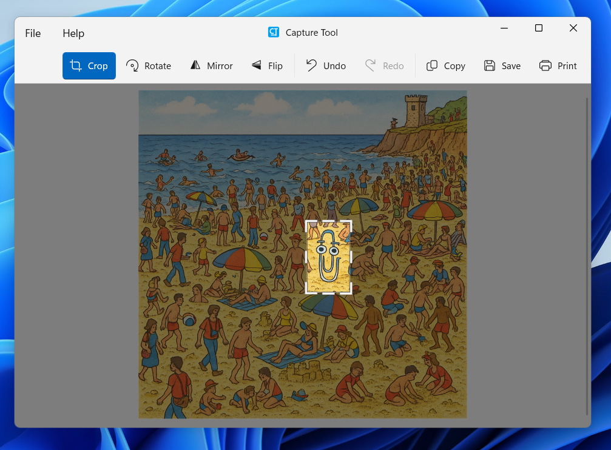

# Capture Tool

Capture, edit, and share screenshots—fast.

Capture Tool is a lightweight and efficient screen capture utility designed for Windows. Whether you're grabbing a quick screenshot or preparing an image for sharing, Capture Tool helps you get it done with ease.

Developed by Shane Weaver

Store link:
https://apps.microsoft.com/detail/9n7w6j13c4w0

