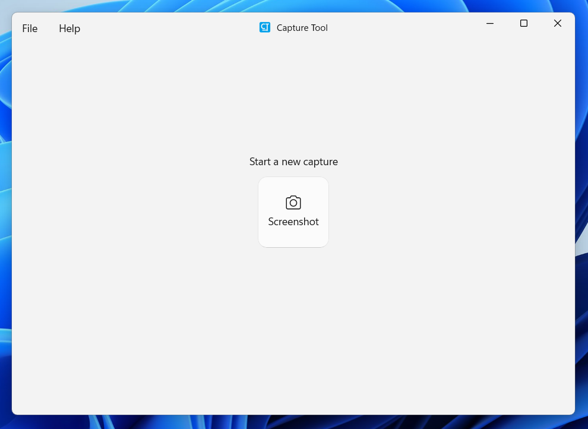

# Capture Tool

Capture, edit, and share screenshots—fast.

Capture Tool is a lightweight and efficient screen capture utility designed for Windows. Whether you're grabbing a quick screenshot or preparing an image for sharing, Capture Tool helps you get it done with ease.

Developed by Shane Weaver

## Documentation

For developers and contributors:

- **[Architecture Overview](docs/ARCHITECTURE.md)** - Complete guide to the application architecture, design patterns, and principles
- **[Coding Practices](docs/CODING_PRACTICES.md)** - Coding standards, conventions, and best practices
- **[Error Handling](docs/ERROR_HANDLING.md)** - Best practices for error handling and recovery
- **[Architecture Review Summary](docs/ARCHITECTURE_REVIEW_SUMMARY.md)** - Summary of recent architectural improvements

## Contributing

Contributions are welcome! Please ensure you:
1. Follow the coding practices outlined in the documentation
2. Write unit tests for new functionality
3. Update documentation as needed
4. Follow the established architectural patterns

## License

This project is licensed under the PolyForm Noncommercial License. See [LICENSE.md](LICENSE.md) for details.

