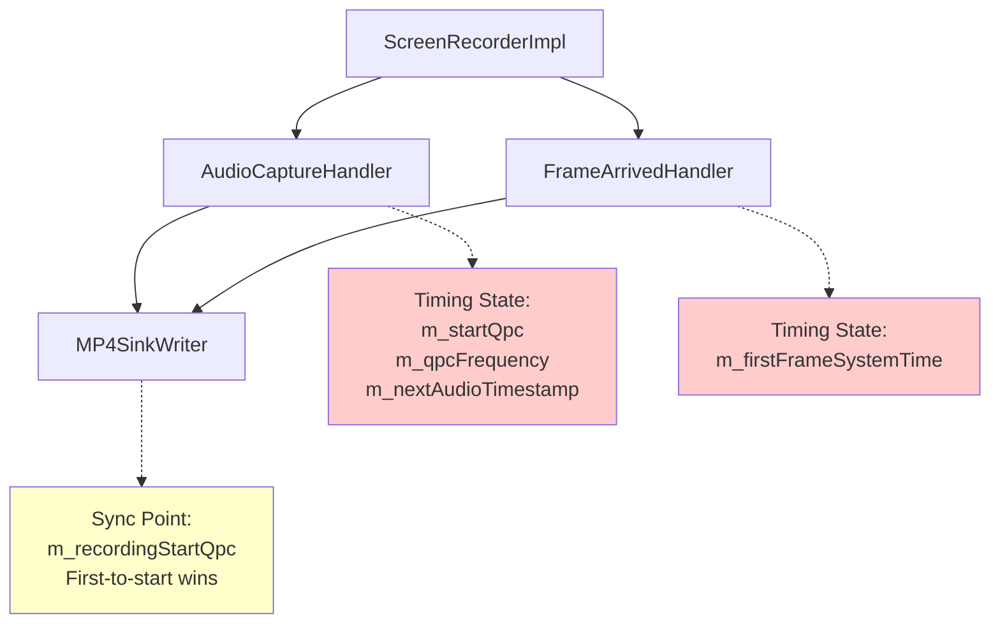
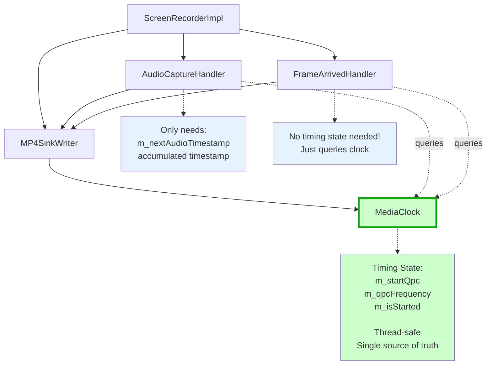
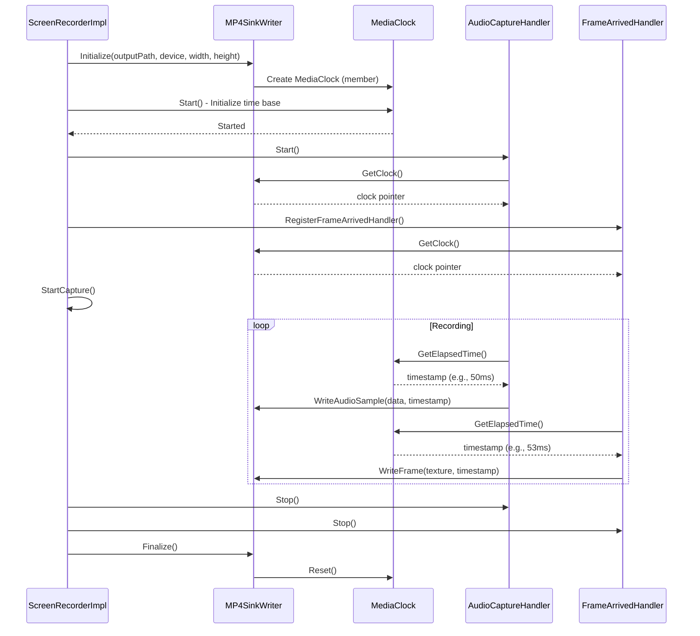
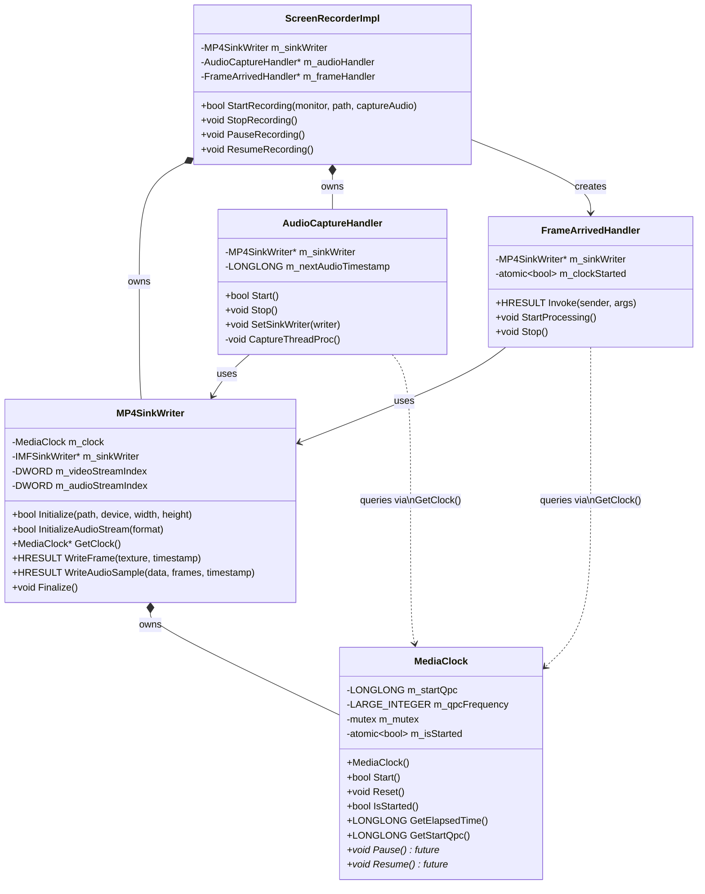
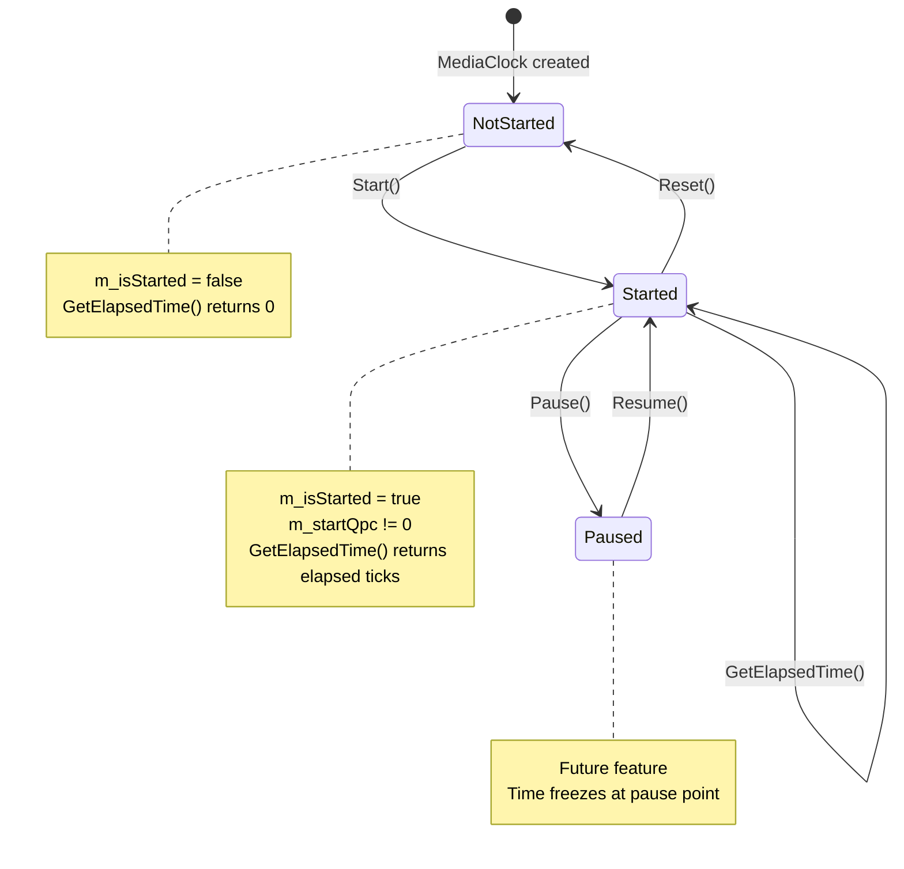
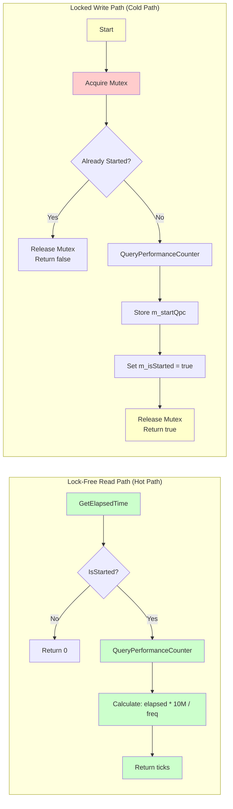
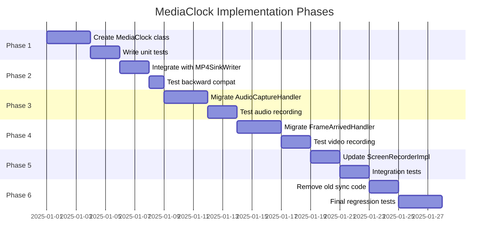
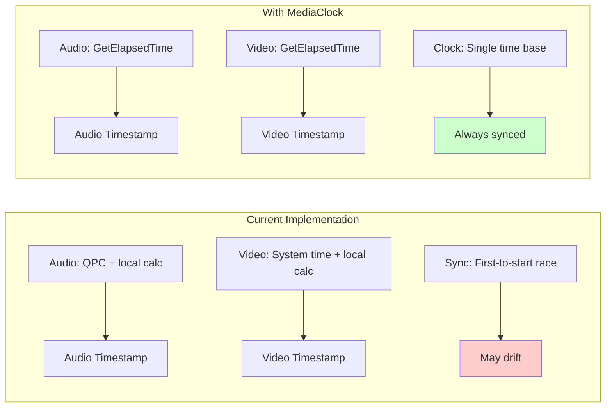
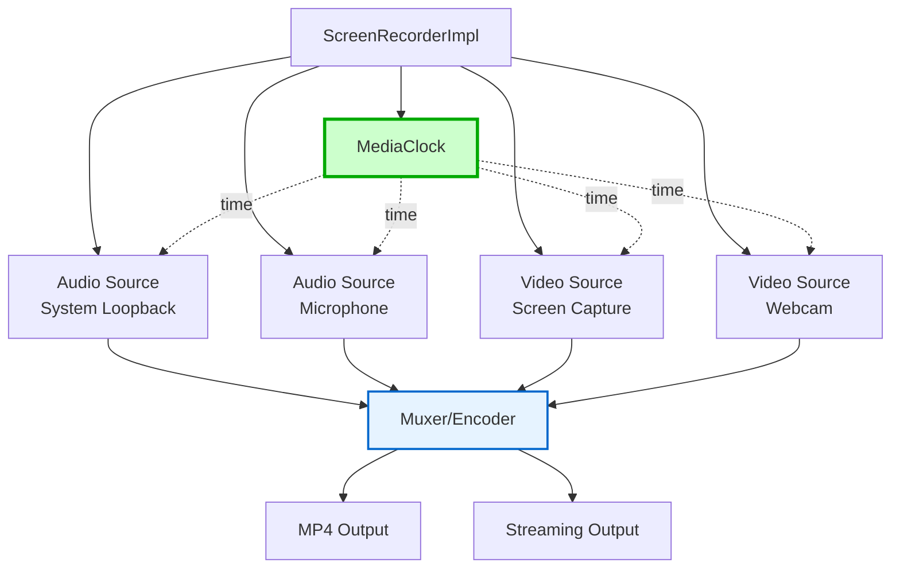

# MediaClock Architecture Diagrams

This document contains visual representations of the MediaClock architecture using Mermaid diagrams (renderable in GitHub and many markdown viewers).

## Current Architecture (Before MediaClock)

**Issues**:
- 🔴 Timing state scattered across multiple components
- 🟡 Race condition: whichever starts first sets m_recordingStartQpc
- 🔴 MP4SinkWriter has dual role (sink + coordinator)

## Proposed Architecture (With MediaClock)

**Improvements**:
- ✅ Single source of truth for timing
- ✅ Clear ownership: MP4SinkWriter owns clock
- ✅ No race conditions: clock started explicitly
- ✅ Consumers only query, don't modify timing state

## Component Interaction Sequence

## Timing Flow Visualization

```mermaid
gantt
    title Recording Timeline with MediaClock
    dateFormat X
    axisFormat %L ms
    
    section Clock
    Start Clock :milestone, m1, 0, 0ms
    GetElapsedTime (50ms) :milestone, m2, 50, 0ms
    GetElapsedTime (100ms) :milestone, m3, 100, 0ms
    GetElapsedTime (150ms) :milestone, m4, 150, 0ms
    
    section Audio
    Audio Start :active, a1, 0, 10ms
    Audio Sample 1 (ts=50ms) :active, a2, 50, 10ms
    Audio Sample 2 (ts=100ms) :active, a3, 100, 10ms
    Audio Sample 3 (ts=150ms) :active, a4, 150, 10ms
    
    section Video
    Video Start :crit, v1, 5, 10ms
    Video Frame 1 (ts=50ms) :crit, v2, 50, 33ms
    Video Frame 2 (ts=100ms) :crit, v3, 100, 33ms
    Video Frame 3 (ts=150ms) :crit, v4, 150, 33ms
```

**Key Points**:
- Clock provides consistent time base
- Audio samples every ~10ms (WASAPI buffer size)
- Video frames every ~33ms (30 fps)
- All timestamps reference same clock → perfect sync

## Class Structure

## State Machine

## Thread Safety Model

**Key Points**:
- Green path (reads): No locks, minimal overhead
- Yellow path (writes): Locked, but rare (once per session)
- Red section: Critical section protected by mutex

## Migration Phases

## Performance Comparison

**Metrics**:
- Current: Each pipeline does QPC + conversion independently
- MediaClock: Each pipeline calls `GetElapsedTime()` (same overhead)
- Net difference: ~1 pointer dereference + 1 atomic load ≈ **< 1% overhead**

## Future Architecture Vision

**Future Benefits**:
- Multiple independent sources
- Flexible routing (mux any combination)
- Multiple output formats simultaneously
- All synchronized via shared MediaClock

---

*These diagrams can be rendered in GitHub markdown viewers, VS Code with Mermaid extension, and many other tools.*
