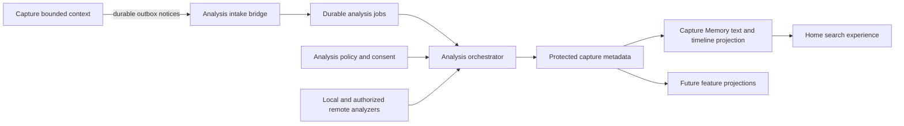
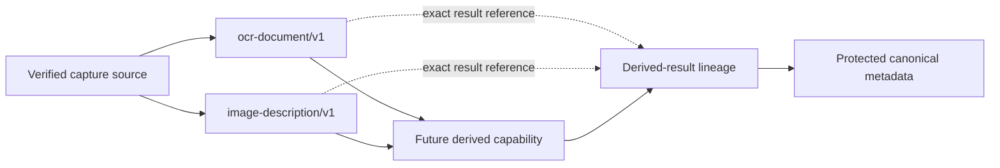
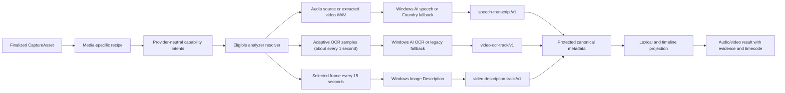
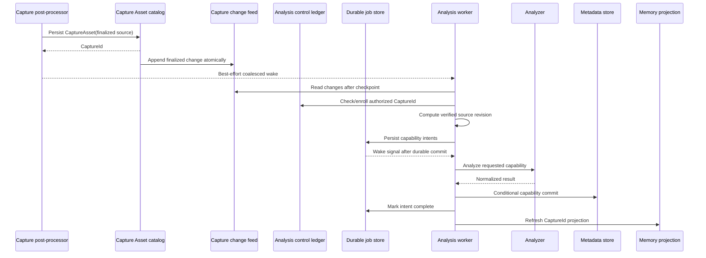

# Architecture: Capture Analysis Platform and Capture Memory

- Status: Evolving implementation
- Date: 2026-08-11
- Scope: Capture Tool desktop application
- First consumer: Capture Memory
- Implementation plan: [plan-capture-analysis-and-memory.md](plan-capture-analysis-and-memory.md)
- Prototype reviewed: `D:\Git\MediaMetadataStudio`

## Summary

Capture Tool will add a new **Analysis bounded context** that derives structured, versioned metadata from media the user intentionally captures. Capture Memory will be the first read-side feature built from that metadata.

The architecture is capability-driven rather than vendor-driven. Application code requests capabilities such as text recognition or visual description. Infrastructure selects an eligible analyzer from Microsoft Windows AI, another local runtime, or an explicitly authorized remote provider. Every provider maps its output into Capture Tool-owned result contracts.

The Capture context gains a small durable `CaptureAsset` catalog and outbox so app-created media has an identity and retained source independent of UI history or auto-save location. A protected, durable Analysis control ledger owns enrollment, exclusions, and tombstone generations. The canonical source of derived knowledge is an app-owned, current-user-protected metadata envelope for each stable `CaptureId`; optimized search projections are disposable and rebuildable. A provider must never own Capture Tool's retention, deletion, consent, or migration semantics.

The first release is local-only and begins with Capture Tool-created images, audio recordings, and videos after explicit opt-in. Preferred analyzers use Windows App SDK AI for OCR, image description, and—behind an experimental provider flag—speech recognition. Devices that cannot run those APIs remain supported through legacy Windows OCR and Microsoft Foundry Local Whisper fallbacks. Video uses Windows media decoding to persist time-coded OCR, selected-frame descriptions, and speech tracks. It does not continuously observe the screen, analyze arbitrary opened files, send capture content to remote models, or provide generated answers over capture history.

The implemented hardening requirements are specified in [Capability dependencies and result lineage](./prd-capture-analysis-capability-dependencies.md) and [Resumable analyzers and managed artifact lifecycle](./prd-capture-analysis-resumable-analyzers.md).

## Goals

1. Establish a reusable metadata pipeline for multiple capture-derived features.
2. Support analyzers from multiple providers without exposing provider SDKs outside infrastructure.
3. Preserve DDD boundaries between capture creation, derived analysis, and presentation.
4. Persist typed results with enough provenance to reproduce, invalidate, compare, and migrate them.
5. Keep analysis asynchronous, resumable, idempotent, and unable to fail a successful capture.
6. Make the data boundary understandable and reversible through explicit consent, forget, clear, and rebuild operations.
7. Support Native AOT, trimming, x64, ARM64, and Capture Tool's Windows 10 minimum while capability-probing newer Windows AI APIs.
8. Make Capture Memory useful without requiring semantic models or a vector database.

## Non-goals

- Passive or continuous screen observation.
- Removing the recent-capture catalog or changing its role as the Home UI history projection.
- Runtime loading of arbitrary third-party plug-ins.
- Persisting raw provider responses as application metadata.
- Automatically falling back from a local model to a remote model.
- Indexing files merely opened for editing in the MVP.
- Full video scene understanding, generated answers, cross-device sync, or watched folders in the MVP.
- Delegating canonical metadata or search ownership to an external/provider-managed index.

## Current context and constraints

Capture Tool already separates domain, application contracts, application orchestration, infrastructure, and presentation. Capture and Edit have dedicated domain and Windows-infrastructure projects, while cross-cutting application ports live in `CaptureTool.Application.Abstractions`.

Relevant seams already exist:

- Image, video, and audio post-processors record successful captures through `IRecentCaptureCatalog`: [image](../src/CaptureTool.Application/Capture/Image/ImageCapturePostProcessor.cs), [video](../src/CaptureTool.Application/Capture/Video/VideoCapturePostProcessor.cs), and [audio](../src/CaptureTool.Application/Capture/Audio/AudioCapturePostProcessor.cs).
- Auto-save can replace a catalog path after a capture is recorded in those same post-processors.
- [`RecentCaptures.json`](../src/CaptureTool.Infrastructure/RecentCaptures/LocalRecentCaptureCatalog.cs) is an atomic, app-local UI-history catalog capped at 1,000 entries and distinguishes `Captured` from `Opened` origins. Its cap, mixed origins, path identity, and user-facing clear semantics make it a migration/backfill source and presentation projection, not the durable owner of captured assets.
- OCR and image-description services already expose application-facing contracts with Windows implementations: [OCR](../src/CaptureTool.Infrastructure.Edit.Windows/WindowsTextExtractionService.cs) and [description](../src/CaptureTool.Infrastructure.Edit.Windows/WindowsImageDescriptionService.cs).
- Existing [`IAiFeatureConsentService`](../src/CaptureTool.Application.Abstractions/Ai/IAiFeatureConsentService.cs) grants individual interactive tools; it does not authorize ongoing background analysis, backfill, or a remote data boundary.
- [`ApplicationStartupInitializer`](../src/CaptureTool.Application/Activation/ApplicationStartupInitializer.cs) initializes durable services after settings load.
- `ICancellationService` supplies a process-wide shutdown signal.
- [`IBackgroundTaskRunner`](../src/CaptureTool.Infrastructure/TaskEnvironment/BackgroundTaskRunner.cs) is fire-and-forget and is not sufficient for durable, ordered AI work.
- The solution enables trimming/AOT compatibility in [`Directory.Build.props`](../Directory.Build.props) and publishes the [WinUI app](../src/CaptureTool.Presentation.Windows.WinUI/CaptureTool.Presentation.Windows.WinUI.csproj) with Native AOT for x64 and ARM64.

These constraints lead to three foundational changes: app-created media needs a durable `CaptureAsset` identity independent of recent history, captured recent entries need to reference that identity, and Analysis needs its own durable worker rather than reusing UI dispatch or fire-and-forget helpers.

## Lessons from MediaMetadataStudio

The prototype proves four useful concepts:

1. analyzers can be registered independently;
2. scans should be queued rather than performed on the UI thread;
3. queued work should survive restart;
4. results should carry analyzer provenance.

The prototype should not be transplanted. It combines every layer in one WinUI project, identifies media by path, stringifies arbitrary `object` values, writes unprotected sidecars beside source files, starts worker tasks from a constructor, and has no durable retry or idempotency policy. A single scanner failure also discards every scanner's successful work.

Capture Tool will preserve the concepts and replace the contracts, persistence, worker, and lifecycle semantics.

## Architectural principles

### 1. Capabilities, not models

Features request a stable capability ID plus an explicit schema version, such as `ocr-document` with schema version `1`. They do not request a specific model. Provider/model selection is an application policy applied to infrastructure descriptors.

### 2. App-owned normalized metadata

Provider responses are mapped into typed Capture Tool contracts. Raw responses are transient and are not retained by default. This prevents a model-specific response shape from becoming the application schema.

### 3. Stable identity, revisioned source

`CaptureId` is identity. A path is a mutable location. A provisional source stamp can be recorded without reading content; a verified `SourceRevision` identifies the bytes that were analyzed so a move does not invalidate results while an edit or replacement does.

### 4. Canonical metadata, disposable projections

Protected metadata envelopes are canonical derived state. Search indexes, embeddings, and thumbnails are projections that can be deleted and rebuilt.

### 5. Capture success is authoritative

Analysis intake is best-effort from the capture workflow. An unavailable model, corrupt metadata record, full queue, or cancelled worker cannot turn a successful capture into a failed capture.

### 6. Explicit data-boundary policy

Local and remote processing are different permissions. There is no silent local-to-remote fallback. A new remote provider or materially new purpose requires explicit authorization.

### 7. Partial progress is valuable

Each capability is scheduled, persisted, retried, and invalidated independently. OCR may remain usable when visual description is unavailable.

### 8. AOT-safe contracts

Persisted payload types are known to source-generated `System.Text.Json` contexts. Reflection-based provider discovery, open-ended `object` graphs, and runtime-generated serializers are excluded.

### 9. Explicit dependencies and exact lineage

A capability that consumes another capability declares that dependency in the recipe. Derived results identify the exact canonical result instances they consumed; dependency ordering, freshness, and cascade invalidation are domain rules rather than analyzer conventions.

## Context map



### Capture bounded context

Owns capture creation, the durable `CaptureAsset` aggregate/catalog, retained source media, preferred open/export location, media type, and the recent-capture history projection. It publishes only lifecycle facts required by Analysis. It does not know which analyzers or features consume them.

### Analysis bounded context

Owns analysis policy, requested capabilities, analyzer provenance, processing state, normalized results, invalidation, and forgetting. It never modifies source media.

### Capture Memory projection

Owns query parsing, lexical ranking over filenames/OCR/descriptions/transcripts, match evidence, timecodes, and result grouping. It reads Analysis metadata through application query contracts and does not invoke provider SDKs directly.

### Presentation

Owns setup, consent dialogs, progress, search state, result explanations, and user commands. It never reads protected metadata files directly.

## Project and layer placement

| Layer/project | Responsibilities |
|---|---|
| `CaptureTool.Domain` | Shared-kernel `CaptureId` value object only; it exposes no Capture aggregate behavior. |
| `CaptureTool.Domain.Capture` | `CaptureAsset` identity/lifecycle semantics and durable-finalization notice semantics. |
| `CaptureTool.Domain.Analysis` (new) | Analysis aggregate, value objects, capability/result semantics, state transitions, and invariants. References the shared kernel, not `CaptureTool.Domain.Capture`. No IO, SDK, JSON, DI, or model vendor references. |
| `CaptureTool.Application.Abstractions/Capture/Assets` | Ports for the durable Capture Asset catalog and capture-finalization outbox. |
| `CaptureTool.Application.Abstractions/Analysis` | Ports and request/response contracts for analyzers, metadata store, control store, job store, policy, feature availability, preparation, intake, queries, search, and lifecycle. |
| `CaptureTool.Application.Abstractions/Security` | Cross-cutting current-user data-protection port used by Capture Assets and Analysis persistence. |
| `CaptureTool.Application/Analysis` | Use cases, recipes, provider eligibility/resolution policy, orchestration, worker lifecycle, backfill/reconciliation, and Memory ranking. |
| `CaptureTool.Infrastructure/CaptureAssets` | Local durable Capture Asset catalog with embedded change-feed/outbox records and source-generated persistence DTOs. |
| `CaptureTool.Infrastructure/Analysis` | Provider-neutral protected document/control repositories, durable job repository, source-generated persistence DTOs, in-memory lexical projection, and feature-availability adapters. |
| `CaptureTool.Infrastructure.Windows/Security` | Windows current-user data-protection adapter. |
| `CaptureTool.Infrastructure.Analysis.Windows` (new) | Windows media facts, stable Windows App SDK AI and legacy Windows OCR adapters, selected-frame image description, nominal video-frame decoding, video-audio extraction, and capability probing. |
| `CaptureTool.Infrastructure.Analysis.Windows.Experimental` | Debug-only adapters that require prerelease Windows AI packages. This assembly is excluded from every non-Debug graph and Store artifact; Windows AI Speech is its first adapter. |
| `CaptureTool.Infrastructure.Analysis.FoundryLocal` | On-device speech-transcription adapter and explicit model-package preparation through Microsoft Foundry Local Core. Native ABI and provider details do not cross this assembly boundary. |
| Future provider assemblies | One assembly per materially different SDK/data boundary, such as an Azure-hosted provider. Each references application contracts, never presentation. |
| `CaptureTool.Presentation/Features/CaptureMemory` | View models and presentation state for setup, preparation, progress, search, forget, clear, search-index rebuild, and reanalysis. |
| `CaptureTool.Presentation.Windows.WinUI` | WinUI dialogs, Home XAML, localization, accessibility, and composition-root registration. |

`CaptureTool.Domain.Analysis` and `CaptureTool.Domain.Capture` both reference the small `CaptureTool.Domain` shared kernel for `CaptureId`; neither bounded-context domain references the other. `CaptureTool.Application` references both. Infrastructure references application abstractions and the domains; presentation references application contracts/use cases. Domain and application layers do not reference a provider assembly.

The existing `WindowsTextExtractionService` and `WindowsImageDescriptionService` are the first Analysis model implementations; the pipeline must reuse them rather than duplicate their Windows AI calls. Their application-facing boundary gains an explicit model/provenance descriptor (or a companion descriptor interface implemented by the same service). Analysis adapters depend only on those abstractions, so `Infrastructure.Analysis.Windows` does not reference `Infrastructure.Edit.Windows` even though the composition root supplies its registered implementations.

### Experimental Windows AI release boundary

`EnableExperimentalWindowsAi` is a compile-time build gate, not a runtime feature flag. It defaults to `true` only for Debug and `false` for every other configuration. When enabled, central package management selects the matching experimental Windows App SDK packages, the WinUI composition root references and registers `CaptureTool.Infrastructure.Analysis.Windows.Experimental`, and its separate provider manifest is copied to the app output. Individual analyzer feature flags still decide whether an included adapter may run.

For Release and Store builds, central package management selects stable Windows App SDK packages, the experimental project reference and provider manifest do not enter the build graph, and Foundry Local remains the speech implementation. A repository-wide MSBuild target rejects both `EnableExperimentalWindowsAi=true` and prerelease Windows App SDK version selections in every non-Debug configuration. Store-package smoke validation independently inspects the resolved NuGet graph and both architecture packages for prerelease packages or experimental payload files. This makes the Store boundary fail closed even if a future experimental analyzer is enabled accidentally at runtime.

### Debug-only AI Model Lab

Provider comparison is a developer tool, not a public settings surface. Debug builds add a global **Debug > AI Model Lab** command (also available with `Ctrl+Shift+M`) that opens a modal inventory of the analyzers actually compiled into that build. Each metadata capability can remain **Auto**, **Prefer** one analyzer with same-boundary fallback, **Force** one analyzer without fallback, or be turned **Off**. The dialog shows a bounded readiness result for each compiled adapter and can explicitly schedule all enrolled captures for reanalysis after a policy change.

The model-selection port lives in Application so the resolver remains provider-neutral. Its production implementation is immutable automatic selection. Debug composition replaces that service with a locally persisted Infrastructure policy and compiles the dialog, menu item, and persistence adapter only under `DEBUG`. Debug composition also enables the two top-level Capture Analysis and Capture Memory flags locally, while their generated Release defaults remain off. A selection revision contributes to `ResolutionPolicyRevision`, so queued and canonical work cannot silently retain an obsolete resolution decision.

Developer selection never grants a new data boundary or processing purpose, and consent remains mandatory before any capture is analyzed. Release platform flags and provider kill switches remain authoritative. Within an already compiled and authorized provider, Debug **Prefer** or **Force** may override an analyzer-specific default-off flag so a developer can exercise that adapter; **Force** and **Off** also filter resolver candidates directly. `EnableExperimentalWindowsAi` still controls build inventory: a stable-parity Debug build cannot select an adapter it did not compile, and every Release build contains only the automatic selection service with no Model Lab UX, top-level flag override, or saved-policy implementation.

## Domain model

### Capture aggregate: `CaptureAsset`

`CaptureAsset` is owned by the Capture bounded context and represents media deliberately created by Capture Tool. It is distinct from a recent-history entry.

Key state:

- `CaptureId`
- media kind
- retained analysis source path/reference
- source ownership/location kind, so legacy external paths are not treated as app-owned files
- optional preferred open/export path, such as an auto-save copy
- captured timestamp
- active/deleted state

New captures are analyzed from the finalized retained source. Auto-save changes the preferred open/export location but does not change identity or require reanalysis of identical bytes. A migrated legacy capture may use its surviving external path as the source and is marked accordingly. Opened/imported files do not become assets unless a later explicit `Add to Memory` use case creates one.

The existing `RecentCaptureCatalogEntry` becomes a projection that may reference a `CaptureId` for captured-origin entries. Opened-origin history entries have no Capture Asset identity.

### Aggregate: `CaptureAnalysisRecord`

The aggregate represents analysis of one capture source revision.

Key state:

- `CaptureId`
- `CaptureMediaKind`
- verified `SourceRevision`
- capture timestamp
- requested recipe version
- independently tracked canonical capability results and latest terminal/unsupported outcomes
- durable result identities and exact upstream-result references for derived capabilities

Key behavior:

- register or update a verified source revision;
- accept a normalized result only for the current source, capability intent, and producer revision;
- record an optional latest terminal/unsupported outcome without owning retry attempts or leases;
- invalidate only stale capabilities after a model/schema/recipe change;
- reject a derived result when any declared input is absent or no longer canonical;
- recursively invalidate dependent results and outcomes when an upstream result changes;
- reject a late completion when the conditional commit token is stale.

Operational ownership is deliberately split. The durable control ledger owns enrollment, requested capabilities, policy/purpose generations, exclusions, and tombstones. The job store owns pending/running state, leases, attempts, retries, and bounded operational failures. The metadata aggregate owns only verified source identity and canonical completed results (plus an optional latest terminal/unsupported outcome). This prevents the aggregate and queue from becoming competing sources of truth.

### Value objects and entities

| Type | Purpose |
|---|---|
| `CaptureId` | Random, stable identity owned by `CaptureAsset`; captured recent entries and Analysis reference it. |
| `ProvisionalSourceStamp` | Non-content facts already available from finalization or migration: length and last-write time. It may be `Unknown`; creating it performs no Analysis file read. |
| `SourceRevision` | Verified length, last-write time, and SHA-256 content fingerprint computed by an authorized worker. |
| `AnalysisCapabilityId` | Stable string ID such as `ocr-document`; not a provider or model name. |
| `CapabilitySchemaVersion` | Version of Capture Tool's normalized payload contract. |
| `AnalyzerIdentity` | Provider ID, model ID/version when exposed, adapter version, runtime/package version, and configuration/prompt fingerprint. |
| `ProcessingBoundary` | `OnDevice` or `Remote`; recorded for each result. |
| `CapabilityAnalysis` | Per-capability canonical result with provenance/timestamps, or latest terminal/unsupported outcome; it has no lease, retry, or attempt state. |
| `CapabilityResultId` | Durable identity of one canonical result instance, independent of payload equivalence. |
| `CapabilityResultReference` | Exact upstream result identity, capability/schema, analyzer revision, and generation time consumed by a derived result. |
| `AnalysisFailure` | Bounded error code and transient/terminal classification; no raw provider text. Retry timing and attempt count belong to the job store. |
| `AnalysisCommitToken` | Expected Capture Asset revision, verified source revision, policy/purpose revision, control generation, capture enrollment generation, recipe version, and resolution-policy revision used for conditional commit. |

### Invariants

- A result belongs to exactly one `CaptureId`, verified `SourceRevision`, capability ID, capability schema version, and producer revision.
- At most one canonical result exists per capability for the current source revision.
- A completion for a forgotten capture, stale source revision, revoked purpose/policy, or stale control generation is rejected by the same conditional critical section that writes the result.
- A remote analyzer cannot become eligible unless the current policy explicitly permits its provider and processing purpose.
- Model unavailability does not invalidate results from other capabilities.
- A recipe dependency graph is acyclic, references capabilities in the same recipe at the exact schema, and never makes a required capability depend on an optional one.
- A derived result references exactly the current canonical instances of all its declared inputs. Replacing or invalidating an input recursively invalidates every dependent result and outcome.
- Inference is labeled as inference; it cannot overwrite an observed fact.

## Capability and result contracts

Initial compiled capability schemas are app-owned and strongly typed. The stable ID never contains the schema version:

| Capability ID | Schema | Classification | Normalized payload |
|---|---:|---|---|
| `media-properties` | 1 | Observation | Media kind, dimensions, duration, encoding facts where available. |
| `ocr-document` | 1 | Machine-extracted evidence | Full text, language candidates, regions/lines/words, geometry, and nullable confidence. |
| `image-description` | 1 | Inference | Brief description, style/purpose, confidence when meaningful. |
| `speech-transcript` | 1 | Machine-extracted evidence | Normalized full text, optional language, and optional ordered segments with time ranges, speaker labels, and confidence. |
| `video-ocr-track` | 1 | Machine-extracted evidence | Normalized full text plus chronological, non-overlapping OCR observations with source-relative start and end times. |
| `video-description-track` | 1 | Inference | Normalized selected-frame descriptions plus chronological, non-overlapping source-relative time ranges. |

Future/example schemas include `content-classification`, `sensitive-content`, `text-embedding`, `image-embedding`, and richer scene/shot graphs. They are not part of the initial compiled set. Capability identifiers are extensible, but each payload accepted into canonical metadata must have a compiled, source-generated Capture Tool schema.

OCR geometry is expressed in pixels in the orientation-corrected source raster: origin at the top left, x increasing right, y increasing down, and rectangles represented as x/y/width/height. The payload records raster width and height. Adapters convert provider-normalized coordinates and EXIF orientation before returning the app-owned contract.

## Analyzer/provider architecture

```csharp
public interface ICaptureAnalyzer
{
    CaptureAnalyzerDescriptor Descriptor { get; }

    ValueTask<CaptureAnalyzerAvailability> GetAvailabilityAsync(
        CaptureAnalysisRequest request,
        CancellationToken cancellationToken);

    Task<CaptureAnalyzerOutput> AnalyzeAsync(
        CaptureAnalysisRequest request,
        CancellationToken cancellationToken);
}
```

`CaptureAnalyzerDescriptor` includes:

- capability and normalized result schema;
- provider, model, and adapter identifiers/versions;
- configuration/prompt/template fingerprint when output can change independently of code/model version;
- supported media kinds;
- processing boundary and declared data sent;
- hardware, OS, package, and model-readiness requirements;
- whether user-visible model preparation is required;
- workload class and maximum supported input;
- retry semantics exposed as bounded codes.

Analyzers are registered as `IEnumerable<ICaptureAnalyzer>` in DI. The application builds an immutable catalog and rejects duplicate descriptor identities during startup. A mutable runtime plug-in registry is unnecessary for the initial product.

### Resolution policy

For each requested capability, the resolver filters and orders analyzers by:

1. compatible capability schema and media kind;
2. feature flag or partner flight;
3. current analysis policy and allowed processing boundary;
4. provider authorization;
5. OS/hardware/model availability;
6. configured preference and measured quality tier.

Fallback is allowed only within the same authorized data boundary. An unsupported/disabled provider or a bounded failed attempt advances to the next eligible analyzer. A higher-ranked model that merely needs preparation instead surfaces `WaitingForPreparation`, preserving the explicit-download contract instead of silently avoiding it. Moving from on-device to remote processing always requires a policy change initiated by the user.

The application reads flags and provider kill switches through `ICaptureAnalysisFeatureAvailability`; `CaptureTool.FeatureManagement` is adapted in infrastructure/composition and is not referenced by the Application project.

### Adding, disabling, or removing a model

- **Add:** implement `ICaptureAnalyzer`, declare its capability/schema/boundary/provenance, register it explicitly, add an independent default-off provider flag when experimental, and pass the shared analyzer contract/evaluation suite.
- **Disable:** turn off its provider flag. New intents re-resolve to another eligible analyzer only within the already authorized boundary; otherwise they remain `WaitingForCapability`. Capture Memory and results from other capabilities continue working.
- **Remove:** remove the DI registration and provider package. Existing normalized results remain readable because envelopes contain app-owned payloads and producer provenance rather than provider DTOs. A product/security revocation can separately invalidate/purge that producer's results.
- **Replace:** advance the producer fingerprint or resolution-policy revision. Only affected capabilities become stale and reanalysis remains policy-controlled.

Adding another implementation of an existing capability requires no Domain or Memory feature change. Adding a genuinely new metadata capability requires a compiled payload schema and recipe revision.

Production retains one canonical result per capability. Alternate-model results may be retained only in a separate evaluation mode using synthetic or separately consented content, with explicit retention limits.

### Provider families

The same port supports several deployment shapes without conflating their trust boundaries:

| Provider family | Example assembly | Boundary and rule |
|---|---|---|
| Windows/on-device | `CaptureTool.Infrastructure.Analysis.Windows` | Prefers Windows App SDK AI Text Recognizer, Image Description, and experimental Speech Recognition after runtime/model-readiness checks. Legacy `Windows.Media.Ocr` remains an OCR fallback. Eligible for the local-only MVP. |
| Microsoft packaged local runtime | `CaptureTool.Infrastructure.Analysis.FoundryLocal` | Acquires and runs the `whisper-tiny` speech model through Microsoft Foundry Local. It is the speech fallback when Windows AI speech is disabled or unsupported. Media stays on device; package acquisition is an explicit user preparation step. |
| Other packaged local runtime | A future `CaptureTool.Infrastructure.Analysis.Onnx` or model-specific assembly | Ships or acquires a local model; must pass Native AOT, architecture, license, size, and preparation review before registration. |
| Microsoft-hosted service | A future Azure/Microsoft provider assembly | Remote boundary; requires provider-specific authorization, secure credentials, declared data sent, and no implicit fallback. |
| Other hosted service | One isolated assembly per SDK/provider | Same remote requirements; cannot share credentials, consent, raw DTOs, or failure types with another provider. |

These names are architectural examples, not commitments to ship every provider. Empty speculative provider projects are not created.

## Analysis recipes

A versioned `CaptureAnalysisRecipe` describes required and optional capabilities for a media kind and feature set. It does not name models.

The image Memory recipe begins with:

- required: capability `media-properties`, schema `1`, and capability `ocr-document`, schema `1`;
- optional: capability `image-description`, schema `1`.

The audio Memory recipe begins with:

- required: capability `speech-transcript`, schema `1`.

The video Memory recipe begins with:

- required: capability `video-ocr-track`, schema `1`;
- optional: capability `speech-transcript`, schema `1`, because a video may have no audio track.
- optional: capability `video-description-track`, schema `1`, because Windows Image Description is hardware/model dependent.

Recipes remain media-specific even though the video recipe reuses speech transcription. This keeps enrollment, invalidation, and provider resolution explicit: video support does not silently broaden the set of files an audio recipe may read.

Embeddings are a later recipe revision with their own producer and storage work; the MVP does not promise vector retrieval. Changing a recipe schedules only missing or stale capabilities. An analyzer/model update invalidates only results produced by the affected producer revision.

### Capability dependency graph

Recipes may also express a directed acyclic graph of capability dependencies. The scheduler materializes provider-neutral intents in topological order. A dependent intent waits without consuming an analyzer attempt until every declared input has a current canonical result, then receives those normalized app-owned results through `CaptureAnalysisRequest.Inputs`. Analyzer adapters never query the metadata store or interpret another provider's raw response.



Dependency definitions are part of recipe semantics and durable job identity. Changing an edge is therefore a recipe change, not an invisible implementation detail. When an upstream result commits, waiting direct dependents are made runnable. The aggregate rechecks their exact input references during conditional commit, closing the race between analyzer execution and an upstream replacement. Upstream invalidation cascades through all transitive dependents, while unrelated capabilities remain usable.

Every canonical result has a durable random identity when first created. Envelopes written before result identity was introduced derive a deterministic local identity from immutable capture, source, capability, producer, boundary, and generation facts. Repeated legacy reads therefore agree before any write occurs; the next normal envelope update persists the derived identities explicitly.

## Metadata persistence

### Capture Asset catalog

`ICaptureAssetCatalog` persists durable asset identity and source/preferred locations under application local data, separate from the capped recent-history JSON. The catalog is source-generated, atomically replaced, and protected to the current user because paths can reveal private information. Unlike Analysis metadata, this catalog is not disposable cache: it is the Capture context's record of app-created assets.

### Durable control versus rebuildable derived state

User intent must survive deletion or eviction of derived cache data. The storage split is therefore:

```text
ApplicationData.LocalPath/
  CaptureAssets/v1/catalog.assets  # assets plus ordered change-feed/outbox records
  CaptureAnalysisControl/v1/control.analysis

ApplicationData.LocalCachePath/
  CaptureAnalysis/v1/items/{captureId}.analysis
  CaptureAnalysis/v1/jobs/{intentId}.job
  CaptureAnalysis/checkpoints-v1/{captureHash}/{checkpointHash}.checkpoint
  CaptureAnalysis/v1/projections/memory/
  CaptureAnalysis/v1/quarantine/
```

`ICaptureAnalysisControlStore` owns the protected, durable `control.analysis` ledger. It contains the schema version, global clear generation, policy/purpose revision, future-capture enrollment watermark, backfill checkpoint, and per-capture enrollment state (`enrolled`, `excluded`, or `forgotten`) plus enrollment/tombstone generation. It contains opaque IDs and no source paths or extracted content. Reconciliation schedules work only for explicitly enrolled assets; the existence of a `CaptureAsset` is never sufficient. Clearing `LocalCache` therefore cannot resurrect a forgotten capture or expand future-only consent into a backfill.

The Capture Asset catalog and its embedded small change-feed/outbox live outside the rebuildable cache, allowing an asset mutation and its notice to commit in one atomic document replacement. Derived envelopes and jobs are recoverable from the asset catalog plus the control ledger, so they may live under `LocalCache`, which Windows excludes from backup/restore ([Windows app-data guidance](https://learn.microsoft.com/en-us/windows/apps/develop/data/store-and-retrieve-app-data)). Every file is schema-versioned, protected to the current Windows user, and atomically replaced through a temporary file in the same directory. Corrupt files are quarantined under opaque IDs. Adjacent `.metadata.json` sidecars are not written by default because source folders may be read-only, synchronized, backed up, or committed to source control.

The local-user protection scheme is not assumed to be portable across devices or OS restores. If a restored protected catalog/control file cannot be decrypted, Capture Tool fails closed: Analysis is disabled, no asset is enrolled or scanned automatically, cached metadata is ignored, and the user may explicitly rebuild identity/backfill from sources still available. This design does not promise cross-device restoration.

The canonical envelope is rebuildable from the source capture, but it is still private application data. User-bound protection reduces offline and cross-account exposure; it is not presented as protection from malware already running as the signed-in user.

Example logical envelope before protection:

```json
{
  "schemaVersion": 1,
  "documentRevision": 7,
  "createdAtUtc": "2026-08-06T22:15:11Z",
  "updatedAtUtc": "2026-08-06T22:15:12Z",
  "captureId": "4fd1e847-37f4-4db6-906f-960d4d8fca22",
  "mediaKind": "image",
  "capturedAtUtc": "2026-08-06T22:15:10Z",
  "sourceRevision": {
    "state": "verified",
    "assetRevision": 12,
    "length": 482193,
    "lastWriteTimeUtc": "2026-08-06T22:15:10Z",
    "fingerprint": {
      "algorithm": "sha256",
      "value": "..."
    }
  },
  "recipeVersion": 1,
  "purpose": {
    "id": "capture-memory-search",
    "version": 1
  },
  "policyRevision": 4,
  "controlGeneration": 3,
  "enrollmentGeneration": 2,
  "resolutionPolicyRevision": 5,
  "results": [
    {
      "capabilityId": "ocr-document",
      "capabilitySchemaVersion": 1,
      "classification": "machineExtracted",
      "status": "complete",
      "producer": {
        "analyzerId": "windows.text-recognizer",
        "providerId": "microsoft.windows",
        "modelId": "text-recognizer",
        "modelVersion": "unknown",
        "adapterVersion": "1.0.0",
        "runtimeId": "windows-app-sdk",
        "runtimeVersion": "unknown",
        "packageVersion": "unknown",
        "configurationFingerprint": "sha256:...",
        "producerFingerprint": "sha256:..."
      },
      "processingBoundary": "onDevice",
      "generatedAtUtc": "2026-08-06T22:15:12Z",
      "payload": {}
    }
  ]
}
```

Normative envelope rules:

| Field | Required | Rule |
|---|---|---|
| `schemaVersion` | Yes | Positive major envelope version; an unknown major version is read-only and is never overwritten. |
| `documentRevision`, `createdAtUtc`, `updatedAtUtc` | Yes | Monotonic per-document revision and UTC timestamps used for optimistic updates/auditability. |
| `captureId`, `mediaKind`, `capturedAtUtc` | Yes | `mediaKind` is one of `image`, `audio`, or `video`. |
| `sourceRevision` | Yes for results | `state=verified`, Capture Asset revision, length, last-write UTC, and `sha256` fingerprint. No capability result commits against a provisional stamp. |
| `recipeVersion`, `purpose`, policy/control/enrollment/resolution revisions | Yes | Identify the recipe, authorized purpose ID/version, and every admission/selection token under which results committed. |
| Result identity | Yes | `capabilityId` is unversioned; `capabilitySchemaVersion` is a positive integer. |
| Result classification/status | Yes | Classification is `observation`, `machineExtracted`, `inference`, or `disposableRepresentation`; status is `complete`, `unsupported`, or `terminalFailure`. |
| `producer`, `processingBoundary`, `generatedAtUtc` | Yes | Boundary is `onDevice` or `remote`; unavailable platform versions use the literal `unknown`. |
| `payload` | Complete only | A compiled app-owned payload. Terminal/unsupported outcomes instead carry a bounded code, never raw provider text. |

`producerFingerprint` (also called `AnalyzerRevision` in domain code) is SHA-256 over the source-generated canonical UTF-8 representation of analyzer ID, provider ID, model ID/version, adapter version, runtime ID/version, package version, and configuration fingerprint in that order. Empty values are normalized to `unknown`; Capture Tool never invents a model version.

For a known envelope containing a future unknown capability or payload schema, the persistence DTO retains the complete result entry as opaque `JsonElement` data and writes it back semantically unchanged while known entries are updated. The Domain ignores unsupported entries. An unknown envelope major version remains read-only. Golden tests cover both downgrade cases so an older build cannot silently erase newer results.

The source path remains in the protected Capture Asset catalog. Jobs persist only `CaptureId` and resolve the current retained source at execution time. Raw provider responses and full-size derived image copies are not retained.

### Search and other projections

For the initial library scale, Capture Memory builds an in-process lexical index over filenames, image OCR, video OCR observations, descriptions, and speech transcripts. Video OCR observation and transcript segment start times are projected as match evidence so temporal results identify where the words occur. This avoids a native vector dependency and a plaintext FTS/WAL store in the MVP. Embeddings/vector scoring require a later explicit analyzer, storage, deletion, and evaluation slice. The current recent-history cap bounds legacy backfill to 1,000 entries but does not define the long-term Capture Asset retention policy; index/database changes follow measured scale.

`ICaptureAnalysisStore` and projection ports hide persistence so a measured future need can introduce an encrypted database without changing the domain or features. Any persistent projection remains app-owned, disposable, and rebuildable from protected envelopes. The MVP does not integrate an OS/vendor content index.

## Capture lifecycle integration

Capture Tool does not currently have a general domain-event bus, and its image/audio post-processors are synchronous. The MVP therefore uses a narrow durable Capture change feed rather than blocking those workflows on Analysis I/O or starting untracked asynchronous work:

```csharp
public interface ICaptureAssetChangeReader
{
    ValueTask<CaptureAssetChangeBatch> ReadAfterAsync(
        long checkpoint,
        CancellationToken cancellationToken);
}

public interface ICaptureAnalysisWakeSignal
{
    bool TrySignal();
}
```

The Capture context atomically persists a `CaptureAsset` and an ordered, content-free change record in its catalog. Change types are finalized, source changed, preferred location changed, and deleted. The Analysis intake consumer checkpoints that feed in its durable control ledger; a best-effort, nonthrowing `TrySignal` only reduces latency. No capture workflow writes an Analysis job directly.

Change records are compacted only after the recent-projection repair path and Analysis checkpoint no longer need them. While Analysis is disabled, its consumer may advance the content-free checkpoint without opening a source; future-only/backfill eligibility is preserved by the durable watermark/enrollment rules rather than by retaining an unbounded event log.

The recent-capture catalog stores a nullable `CaptureId`: captured-origin entries reference their asset when that transaction succeeded; opened-origin entries do not. Existing captured-origin entries receive assets/IDs during migration, using the only surviving catalog path as their source because the earlier retained-to-auto-save mapping cannot be recovered.

For new captures, auto-save updates `PreferredOpenPath` and the recent projection while `RetainedSourcePath` remains the analysis source. A source-byte replacement changes `SourceRevision`; a location-only change does not. Capture Asset change notification refreshes filename/location fields in feature projections without scheduling model work.

The existing early `NewVideoCaptured`/`NewAudioCaptured` UI event timing remains unchanged. A separate Capture Asset change is appended only after retained source finalization. Finalization performs no hash, model preparation, or Analysis file read. It records only facts already available from the write, including length/last-write when available, and never waits for SHA-256 or analyzer execution.

Capture success remains authoritative across partial persistence failures:

1. If the Capture Asset/change-feed write succeeds and recent-history update fails, the pending Capture change repairs the recent projection at startup.
2. If the asset write fails, the capture remains successful and the recent entry is written with a nullable ID when possible; startup reconciliation assigns an ID from that captured-origin entry or an orphaned file in the app-owned retained-capture directory.
3. A crash between any two steps is repaired idempotently from the catalog change feed, recent history, and app-owned retained directory without reading file content.
4. External/legacy locations are never directory-scanned or claimed as app-owned.

Auto-save updates only the asset's preferred location and recent projection. Startup reconciliation consumes Capture changes and compares only explicitly enrolled assets with Analysis state. It cannot infer enrollment merely because an asset exists.

Opened/imported entries are excluded by default. A later `Add to Memory` command can create an explicit analysis relationship without changing that default.

## Temporal media pipeline

Audio and video use the same provider-neutral capability-intent lifecycle as images. Temporal work is not a second queue and does not introduce a media-specific persistence store.



The audio slice hands the finalized app-owned WAV source to the resolved `speech-transcript/v1` analyzer. Windows AI Speech Recognition is the higher-quality experimental option; Microsoft Foundry Local remains the stable local fallback. Both adapters create only app-owned working copies when their APIs require paths, delete those exact temporary files after each call, and return only the normalized Capture Tool payload. The queue never stores a provider path or raw response.

The speech adapters plan source-relative WAV windows of at most 15 seconds. Each non-empty window becomes a transcript segment whose time range maps back to the original capture, so the lexical projection can return a useful timecode even when a runtime returns only full text. If a later runtime supplies finer native segments, its adapter can preserve and offset those ranges inside the window instead of replacing them with the coarse fallback. Windowing also keeps each inference call bounded. This is adapter policy, represented in `AdapterVersion` and the configuration fingerprint; it does not change the provider-neutral transcript schema.

The provider references the Microsoft Foundry Local Core package and isolates its small native command ABI inside the infrastructure assembly. This avoids exposing provider types and keeps Capture Tool's Native AOT build warning-free while the managed Foundry 1.x audio client retains a reflection-based response dependency. The adapter is replaceable in place when a public AOT-safe managed audio session is available; the analyzer port, recipe, metadata, and search projection do not change.

Video is deliberately a composition of capabilities rather than one special "scan video" operation. The video recipe schedules frame OCR, selected-frame description, and audio demultiplexing/transcription independently, then projects all three forms of time-coded evidence into the same search result contract. OCR is scheduled first so useful visual text becomes searchable before slower optional speech and description work. The Windows frame source selects the first frame, approximately one nearest frame per second, and the final decodable frame with `MediaComposition.GetThumbnailAsync(..., NearestFrame)`. For long videos it increases the interval just enough to stay within 1,000 OCR samples. Each selected frame is sent to the preferred ready OCR service; consecutive identical recognized text is coalesced into one time range extending to the next sample boundary. This bounds model work while retaining deterministic first/final coverage.

Visual description uses a separate bounded sampling policy: the first frame and then one nearest frame every 15 seconds, capped at 1,000 observations. Each description is stored with its selected source-relative time range as `video-description-track/v1`. The capability is optional because Image Description requires supported Windows AI hardware and model readiness; an unsupported outcome does not block the required OCR track.

The Windows audio adapter checks for an embedded audio track and uses `MediaTranscoder` with a WAV profile. The resulting WAV enters whichever speech analyzer the resolver selected, so its segments remain relative to the original video timeline. Videos without audio still produce a usable required OCR track and optional visual-description track; the optional speech capability records a bounded unsupported outcome.

Source copies, decoded frame streams, and demuxed audio are disposable app-created working artifacts. The frame stream is held only for one OCR call, the WAV is opened with delete-on-close behavior, and exact working paths are cleaned in `finally` blocks. Cleanup is constrained to the exact Analysis working directory; abandoned app-created video working files older than seven days are pruned on later use. Canonical state remains normalized capability results tied to the original video's verified `SourceRevision`; no derived frame or audio file becomes user content.

Long-running analyzers may use the provider-neutral checkpoint supplied on `CaptureAnalysisRequest`. Checkpoint identity includes capture, verified source revision, capability/schema, and analyzer revision, so state from different bytes or producer behavior cannot be resumed accidentally. Payloads are current-user protected, atomically replaced, bounded to 64 MiB, treated as disposable, and never accepted as canonical metadata. The video OCR adapter checkpoints its normalized observations, current coalescing span, and exact next sample timestamp every ten successful samples; after interruption it asks the frame source to resume at that timestamp instead of decoding the prefix again. Successful, stale, terminal, or user-cancelled work clears the checkpoint; transient interruption preserves it, and abandoned checkpoints older than seven days are pruned at worker startup.



## Durable worker and job state

The job store, not an in-memory queue, is authoritative. A capacity-one `Channel` carries coalesced wake signals only. Producers call non-blocking `TryWrite`; a full channel means a wake is already pending and can never delay capture finalization.

The durable unit is a provider-neutral **capability intent**, keyed by:

```text
CaptureId + VerifiedSourceRevision + CapabilityId + CapabilitySchemaVersion
+ RecipeVersion + ControlGeneration + ResolutionPolicyRevision
+ OrderedCapabilityDependencies
```

Provider-bound attempts live beneath the intent and record the selected `AnalyzerIdentity`. The resolver may try another provider only sequentially within the same intent and authorized processing boundary. This prevents provider-specific jobs from racing to become the one canonical result. A producer/model preference change advances `ResolutionPolicyRevision` and marks the affected canonical result stale; `AnalyzerRevision` is result provenance, not intent identity.

Dependency-free jobs retain their original durable filename identity for backward compatibility. Dependency-aware jobs add the normalized direct dependency set to that opaque hashed identity, so two different graphs cannot alias the same persisted intent.

Job states:

- `Pending`
- `Running`
- `WaitingForCapability`
- `RetryScheduled`
- `Completed`
- `Cancelled`
- `TerminalFailure`

Durable fields include provider-attempt history, attempt count, next-attempt time, lease expiry, bounded failure code, policy/purpose revision, control/enrollment generation, and recipe/resolution-policy version. Job files are current-user protected, schema-versioned, atomically replaced, and quarantined when corrupt. Enqueue is committed before a wake signal is published.

The worker:

- starts explicitly from `ApplicationStartupInitializer` after settings and policy are loaded;
- uses the process-wide cancellation token, but every transition is crash-safe because the current host cannot guarantee an awaited shutdown;
- runs no more than one AI-heavy analyzer at a time initially;
- after authorization and enrollment, computes the verified content fingerprint off the capture path, confirms the provisional file facts did not change during hashing, and only then materializes capability intents;
- calls `TryLeaseNextDueAsync(now)` and recovers expired leases both at startup and while the app remains open;
- waits for the earlier of a channel notification or a timer for the next durable due time, then drains all due work;
- moves dependent intents to `WaitingForCapability` until every declared canonical input is present, and wakes direct dependents when an upstream result commits;
- passes only normalized canonical dependency inputs to the analyzer and persists their exact result references with the output;
- supplies an analyzer-revision-scoped protected checkpoint and prunes abandoned checkpoints on startup;
- writes each capability result independently through `TryCommitCapabilityAsync(commitToken, result)`;
- applies bounded exponential backoff only to classified transient failures;
- rechecks source revision and policy before invocation;
- does not silently download/prepare a model from the background queue;
- leaves work in `WaitingForCapability` until a user-facing preparation flow succeeds;
- needs no Windows OS background task in the MVP and resumes while the app is next open.

`TryCommitCapabilityAsync` runs under the same process-wide per-capture critical section used by control mutations. It re-resolves the asset and succeeds only when the expected Capture Asset revision/file stamp, verified source revision, policy/purpose revision, global control generation, per-capture enrollment/tombstone generation, recipe version, and resolution-policy revision still match. It then atomically replaces the envelope. Forget, clear, and revocation operations persist the new control token before cleanup; a Capture source update increments the durable Asset revision before publishing its change. A blocked analyzer therefore cannot pass a check-then-write race.

Crash ordering is normative:

1. conditionally commit the normalized result;
2. mark the capability intent `Completed`;
3. refresh the disposable projection.

The job is never completed before its result commit. A crash after the result commit replays an idempotent conditional upsert and then completes the intent. A crash after claim leaves an expiring lease. Projection refresh is always replayable from metadata.

Model preparation is a separate application workflow: `GetAnalysisPreparationState` reports readiness and `PrepareAnalysisCapability` performs an explicitly initiated preparation with progress/cancellation. Successful preparation wakes waiting intents. Presentation never calls an analyzer or `EnsureReadyAsync` implementation directly.

## Consent and provider policy

Background analysis is broader than invoking OCR on one image, so it receives a dedicated policy instead of being added as another boolean to `IAiFeatureConsentService`.

`CaptureAnalysisPolicy` contains:

- enabled/disabled state;
- policy revision;
- authorized purpose ID and purpose version;
- future-capture scope and the Capture Asset sequence watermark after which new assets may be enrolled;
- whether the user approved a one-time existing-capture backfill;
- allowed processing boundaries;
- allowed remote provider IDs and declared purposes;
- retention preference when one is later offered.

The authorized purpose is `capture-memory-search` version `3`. Version 2 added time-coded video frame OCR and video speech analysis; version 3 adds inferred descriptions of selected video frames. Earlier policy state therefore enters consent review instead of silently expanding the derived metadata. A materially new consumer of metadata requires privacy review and either a policy-version migration that is provably within the existing promise or renewed consent. Provider authorization never implies authorization for a new purpose.

`CaptureAnalysisPolicyService` coordinates the existing transactional settings with the control ledger, whose admission revision is authoritative to the worker. Enabling writes the user choice first and publishes an enabled control revision last; revocation/clear publishes the denying control revision first and then updates presentation settings. A partial failure therefore fails closed and is reconciled on next startup; settings alone can never authorize work.

MVP setup is off by default and offers:

- analyze future Capture Tool images, audio recordings, and videos locally;
- optionally analyze existing captured-origin images, audio recordings, and videos;
- cancel without any model preparation or work.

Remote processing is a later, separate permission. Provider credentials or tokens use an OS credential facility and are never stored in the metadata envelope or normal settings JSON.

This consent is independent from the existing manual editor OCR and image-description consents: neither grants the other. Model/package preparation is also a distinct, user-initiated action after Analysis consent; it authorizes acquiring/preparing a local capability, not reading captures for another purpose and not sending content online.

Recommended product copy:

> Find images and recordings by what is inside. Capture Tool uses on-device AI to analyze only captures you create. Some model packages may be downloaded during setup, but capture content is not uploaded. It does not continuously record your screen or send capture content to an AI service. Your original captures remain in Capture Tool's local storage. You can remove individual items or erase all analysis data at any time.

## Pause, forget, clear, reanalyze, and deletion semantics

The MVP avoids an ambiguous on/off toggle:

- **Pause processing:** an optional session-level control that cancels/halts worker execution but preserves enrollment, metadata, and search. It is not required for the MVP.
- **Stop analyzing new captures:** durably disables admission of subsequently finalized assets and records the current asset-sequence watermark; existing metadata remains searchable and already enrolled work may finish. Re-enabling future-only starts after a new current watermark and does not backfill the gap. Use Pause or Turn off and erase when already enrolled work must stop.
- **Turn off and erase Capture Analysis:** revokes processing, advances the global control generation, clears enrollment, sets the future watermark to the current asset sequence, cancels jobs, and purges all derived metadata/projections. This is the MVP Settings removal action.
- **Remove from Memory:** durably mark one `CaptureId` forgotten, advance its enrollment generation, cancel jobs, and delete its Analysis results/projections; keep the source and Capture history unless the user also chooses to forget history.
- **Forget recent capture:** remove the recent entry and active Capture Asset path/location record, durably retain only a minimal path-free `CaptureId` tombstone, and remove Analysis state. The source file remains where it is, matching the existing history-removal promise.
- **Clear Memory:** while future analysis remains enabled, durably advance the global generation, forget the currently enrolled set, reset the future-enrollment watermark to the current highest asset sequence, cancel jobs, and purge metadata/projections. Only captures finalized after that watermark are automatically enrolled; old assets require an explicit new backfill/add action.
- **Rebuild search index:** delete and reconstruct only disposable projections from protected metadata. It invokes no AI, reads no source media, and needs no model preparation.
- **Reanalyze captures:** an explicit, consent-checked operation that creates new capability intents for stale/selected results. It may require model preparation and source reads and is never labeled as an index rebuild.

Ownership controls source deletion separately from history/analysis deletion:

| Command/source kind | App-owned retained source | Legacy/external source | Preferred export/auto-save copy |
|---|---|---|---|
| Remove from Memory | Keep | Keep | Keep |
| Forget recent capture | Keep file; remove active path record | Keep file; remove active path record | Keep |
| Delete capture | Tombstone first, then delete after explicit confirmation; retry cleanup if needed | Never delete through the generic command; offer Remove from Capture Tool/Reveal instead | Never delete implicitly |
| Clear/turn off Analysis | Keep | Keep | Keep |

Control-ledger mutations are authoritative and commit before asynchronous cleanup. A late analyzer completion with an older generation is rejected. The product promises logical removal from Capture Tool-managed state, not forensic erasure from SSD wear leveling, crash dumps, backups, or copies outside the app.

## Capture Memory query architecture

`SearchCaptureMemoryUseCase` queries `ICaptureMemorySearchService`. The service combines available projections and returns app-owned results containing:

- `CaptureId` and current preferred/open location resolved through the catalog;
- thumbnail request information, not a persisted full-size copy;
- capture time and media kind;
- match type and evidence snippet;
- optional OCR geometry or timecode;
- rank and enabled backend identifiers for diagnostics without content.

The baseline ranker weights exact filename matches, image/video OCR tokens and phrases, transcript tokens and phrases, description tokens, and a small recency tie-breaker. Audio results use a media-specific icon and show transcript evidence plus an optional segment timecode. Video results use their own media icon and show either OCR or transcript evidence with the corresponding source-relative timecode. The result still opens through the existing Capture Asset/recent-capture route. Titles, tags, embeddings, and vector scoring are deferred until their ownership/update and producer lifecycle exist.

Features never read provider-specific results. They query normalized metadata or a feature projection.

The indexed display filename comes from `PreferredOpenPath` when present and otherwise from `RetainedSourcePath`. The Memory projection consumes preferred-location changes from the Capture change feed so filename matches remain current without re-running Analysis.

## Dependency injection and lifecycle

Proposed registrations:

```text
AddCaptureAnalysisApplicationServices()
  singleton: policy, feature availability, analyzer resolver, orchestrator, worker, Memory projection
  transient: enable/disable/backfill/prepare/search/forget/rebuild-index/reanalyze use cases

AddCaptureAnalysisInfrastructure()
  singleton: protected control store, metadata store, durable job store, projection store

AddCaptureAssetInfrastructure()
  singleton: protected asset catalog/change feed

AddWindowsCaptureAnalyzers()
  singleton enumerable: media properties, OCR, image description
  singleton: provider feature-availability and preparation adapters

AddFoundryLocalAnalysisProvider()
  singleton enumerable: speech transcript
  singleton: Foundry Local runtime/preparation adapter

AddWindowsServices()
  singleton: current-user data protection
```

The WinUI composition root adds the new Windows Analysis infrastructure project alongside Capture and Edit infrastructure. Tests can register fake analyzers and an in-memory store without loading Windows AI packages.

## Security, privacy, telemetry, and logs

- Analyze only intentional captured-origin media after policy grant.
- Keep media analysis on device. Network access is limited to explicit model-package preparation; capture media and derived text are not uploaded.
- Protect the Capture Asset catalog/change feed, Analysis control ledger, metadata, job records, and any persistent projection to the current user.
- Do not persist raw prompts, raw provider responses, full-size derived copies, or temporary extracted frames.
- Do not emit query text or hashes, OCR, captions, paths, filenames, window titles, thumbnails, embeddings, or content IDs to telemetry.
- Emit only coarse, consented operational buckets such as capability availability, result-count range, latency range, clicked-rank range, and bounded failure code.
- Never log free-form provider exception messages because they can contain paths or content. Map them to bounded codes; retain developer diagnostics only in explicitly enabled, content-safe instrumentation.
- Document that current-user protection does not defend against malware running as that user.
- Promise logical removal from app-managed stores and projections, not forensic erasure from SSD wear leveling, crash dumps, OS backups, or user-created copies outside Capture Tool.

## Reliability and failure behavior

- Capture completion never awaits fingerprinting, model preparation, an Analysis job write, or an analyzer; only the bounded Capture Asset/change-feed write is attempted synchronously.
- A corrupt envelope is quarantined by opaque ID, reported with a bounded error, and rebuilt from source if still authorized.
- A missing source is tombstoned before cleanup and cannot remain searchable.
- Partial analyzer success remains committed.
- Model/provider unavailability degrades individual capabilities, not the whole item.
- Missing dependency inputs defer a derived job without spending an analyzer attempt; upstream replacement recursively invalidates stale dependents.
- Analyzer checkpoints are recovery aids only: corrupt checkpoints are discarded, checkpoint I/O cannot invalidate a successful analysis, and no checkpoint is projected into search.
- Index corruption produces "Your captures are safe" and offers **Rebuild search index**, which invokes no model.
- Job, control, and metadata writes are protected/schema-versioned/atomic and survive process termination between stages.
- Startup reconciliation repairs missed Capture changes, expired leases, source moves represented in the catalog, and stale model/recipe revisions, but schedules only assets enrolled by the durable control ledger.

## Testing strategy

### Domain tests

- aggregate state transitions and invariants;
- stale-source and late-completion rejection;
- partial success, failure classification, and forgetting;
- recipe/model revision invalidation;
- dependency graph validation, topological execution, exact input provenance, and transitive invalidation;
- remote-provider eligibility rules;
- a source-byte revision invalidating every source-derived capability, while a producer revision invalidates only affected capabilities.

### Application tests

- analyzer resolution and same-boundary fallback;
- durable-enqueue-before-wake ordering;
- worker cancellation, leases, same-session timer-driven retries, and independent commits;
- dependency waiting/wake behavior and normalized-input handoff;
- deterministic commit races against source change, policy revocation, forget, and clear;
- crash points after claim, after result commit, and after job completion;
- startup reconciliation and existing-capture backfill;
- ingestion never changing capture outcomes;
- search ranking, evidence, and deterministic merging;
- stop-new, turn-off-and-erase, forget, clear, rebuild-index, and reanalyze use cases.

### Infrastructure tests

- source-generated round trips and migrations, including known envelopes containing opaque unknown capabilities;
- current-user protection and absence of plaintext canary content;
- atomic write recovery and corrupt-file quarantine;
- job lease/retry persistence across restart and corrupt-job quarantine;
- protected checkpoint round trips, corruption discard, capture/global deletion, and retention pruning;
- projection rebuild and deletion;
- x64 and ARM64 provider assets.

### Provider contract tests

Every analyzer adapter runs a shared contract suite for descriptor validity, cancellation, maximum input handling, normalized payload validity, bounded errors, and no invocation while unavailable or unauthorized.

### Presentation and UI tests

- opt-in/backfill and model-preparation flows;
- search keyboard behavior and match explanations;
- partial-indexing, unavailable-model, no-result, and corrupt-index states;
- forget/clear/delete language and accessibility;
- opened/imported files excluded by default.

### Privacy tests

- feature disabled produces no Analysis content reads, fingerprints, results, jobs, model preparation, or network calls; independent Capture Asset lifecycle metadata may still be maintained;
- canary OCR strings never appear plaintext in storage, logs, telemetry, or crash diagnostics owned by the subsystem;
- clear/forget survive restart and interrupted cleanup;
- one Windows user cannot decrypt another user's metadata;
- removed items do not return after projection rebuild;
- deleting all rebuildable `LocalCache` data cannot remove enrollment exclusions/tombstones or cause old assets to be analyzed;
- migration and the disabled state perform zero capture-content reads.

## Evaluation architecture

Provider comparison uses a versioned synthetic or separately consented corpus outside normal product telemetry. The harness records corpus version, query set, provider/model/adapter versions, device class, cold/warm state, and normalized metrics.

Initial metrics include Precision@1, Recall@5 for exact and semantic queries, nDCG@5, no-match false positives, indexing time, warm search latency, cold readiness, memory, and protected storage size. Production telemetry is not a source of prompts, labels, or training examples.

## Alternatives considered

### Adjacent JSON sidecars

Rejected as the default. They require write access to source folders, couple identity to filename, expose derived sensitive text to sync/backup/source control, and make deletion dependent on locations outside app control. A portable sidecar remains a deliberate export format only.

### One global metadata JSON file

Rejected. A single slow analyzer completion would rewrite unrelated items, increase corruption blast radius, and make independent migration/quarantine difficult. One protected envelope per asset keeps atomic updates and failures local.

### SQLite/FTS as the initial canonical store

Deferred. It offers excellent querying and transactions, especially once audio/video create many segments, but adds native/AOT packaging work and can leave sensitive text in an unencrypted database/WAL unless a suitable encryption design is adopted. The ports deliberately allow an encrypted database later when measured scale justifies it; the canonical logical model remains the same.

### General-purpose event bus

Deferred. Capture Tool currently uses explicit application seams. The durable Capture Asset change feed supplies the required context boundary without introducing infrastructure that has no other consumer.

### Runtime plug-in discovery

Rejected for the initial product. Explicit DI registration is deterministic and compatible with trimming/Native AOT. "Multiple sources" means multiple compiled provider adapters behind the same ports, not loading arbitrary assemblies at runtime.

## Decisions

1. Create an Analysis bounded context; Capture Memory is its first projection.
2. Put `CaptureId` in the existing shared kernel; neither bounded-context domain references the other.
3. Add a durable `CaptureAsset` catalog/change feed in the Capture context; recent captures remains a UI-history projection and migration source.
4. Use a protected durable Analysis control ledger for enrollment, purpose generations, exclusions, and tombstones; never place user intent only in rebuildable cache.
5. Use stable `CaptureId` across Capture, Analysis, and captured recent-history entries; paths are mutable locations only.
6. Analyze the finalized retained source; auto-save changes only the preferred open/export location.
7. Do not hash or otherwise read capture content for Analysis before authorization; materialize capability intents only after a verified source revision exists.
8. Use app-owned typed metadata envelopes as canonical derived state, preserving unknown future capability entries losslessly on downgrade.
9. Protect the Capture Asset catalog/change feed, control ledger, canonical metadata, and durable jobs to the current Windows user.
10. Do not write adjacent sidecars by default; portable metadata export is separate future work.
11. Request capability ID plus schema version and normalize results; keep vendor/model SDKs in infrastructure.
12. Reuse Capture Tool's existing OCR and image-description model implementations through provenance-aware adapters; do not duplicate their model calls.
13. Do not integrate an OS/vendor content index; build the app-owned Memory projection from normalized metadata.
14. Use the Capture catalog change feed plus non-blocking wake instead of a general event bus or asynchronous calls from synchronous finalization.
15. Use provider-neutral capability intents, a durable job store, a capacity-one wake channel, due-time polling, and conditional result commits; do not reuse `IBackgroundTaskRunner`.
16. Build the MVP Memory index in process and keep every optimized projection disposable.
17. Ship local-only analysis first; remote providers require separate policy and consent.
18. Add temporal media through media-specific recipes and normalized time-coded capability results; do not create a separate audio/video job system.
19. Use Microsoft Foundry Local as the first speech provider behind the existing analyzer port, with explicit package preparation and no remote media processing.
20. Isolate the Foundry Local Core native command ABI inside its provider assembly until an AOT-safe public managed audio session can replace it.
21. Produce dependable source-relative audio timecodes with bounded WAV windows, while preferring finer provider-native segments whenever they are available.
22. Implement video as independent `video-ocr-track` and optional `speech-transcript` capabilities: OCR every bounded nominal frame, coalesce only canonical duplicate text, and delete derived frame/audio artifacts after use.
23. Model multi-stage analysis as an acyclic recipe dependency graph, pass only normalized canonical inputs to analyzers, and persist exact upstream result references.
24. Make upstream replacement invalidate transitive dependents and wake only dependency-ready intents; do not let analyzers coordinate through provider state or storage queries.
25. Support long-running analyzers with bounded, current-user-protected, analyzer-revision-scoped disposable checkpoints; resume sampled video OCR from an exact media timestamp and prune abandoned checkpoints and working artifacts after seven days.
26. Keep provider/model comparison in a Debug-only AI Model Lab; route its Auto/Prefer/Force/Off choices through the application resolver, retain provider authorization as a hard boundary, and compile the UX and mutable local policy out of Release.

## Open questions

These do not block the local on-device Capture Memory platform unless noted:

- Should a separately labeled, non-destructive Pause processing control be offered after the MVP?
- Should a user be able to export a portable metadata sidecar or capture package?
- What default retention, if any, should apply as the Capture Asset catalog grows beyond the initial 1,000-entry legacy migration set?
- Should any Model Lab preference graduate from Debug into a separately consented partner or public settings surface after evaluation?
- Should a local sensitive-content result skip only remote analyzers, or optionally exclude the item from all Memory indexing?
- When a user edits and overwrites an original capture, should Analysis automatically re-run or require an explicit refresh?
