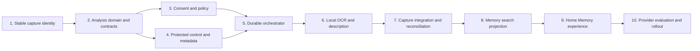

# Implementation Plan: Capture Analysis Platform and Capture Memory

- Status: Proposed
- Date: 2026-08-06
- Architecture: [architecture-capture-analysis-platform.md](architecture-capture-analysis-platform.md)
- Product outcome: Find a screenshot by what was in it, not by filename or date
- Initial data boundary: On-device only
- Initial media scope: Images, audio recordings, and videos created by Capture Tool

## Outcome

Deliver an opt-in Capture Analysis platform that produces protected, versioned, model-neutral metadata, then ship Capture Memory as its first vertical feature.

The MVP is complete when a user can:

1. explicitly enable on-device analysis for future screenshots;
2. optionally backfill existing Capture Tool-created screenshots;
3. capture normally without waiting for analysis;
4. search Home using visible text or a visual description;
5. understand why each result matched;
6. open the result in Capture Tool;
7. forget one item, erase all analysis, rebuild only the search index, or explicitly reanalyze;
8. use OCR-only search when optional semantic/description capabilities are unavailable.

## MVP boundaries

Included:

- Durable Capture Asset catalog and stable identity.
- Durable Capture change feed and protected Analysis control ledger.
- Dedicated Analysis bounded context.
- Provider-neutral analyzer contracts.
- Protected, per-capture metadata envelopes.
- Durable, restartable background work while the app is open.
- Media facts, OCR, and optional brief image descriptions.
- In-process lexical search over filenames, OCR, and descriptions.
- Home search, match explanations, progress, forget, clear, search-index rebuild, and explicit reanalysis.
- Synthetic/provider evaluation tooling.

Excluded:

- Passive screen observation.
- Analysis of merely opened/imported files.
- Cloud processing or implicit cloud fallback.
- Remote audio/video analysis.
- Chat or generated answers over the library.
- Cross-device sync, watched folders, and shell-wide search.
- A public provider/model picker.
- Any OS/vendor-managed content index; Memory search is app-owned.
- Embedding generation or vector retrieval; these require a later complete producer/storage/deletion slice.

## Delivery strategy

Work lands as independently testable, feature-flagged workstreams. Larger workstreams are split into the named PR sub-slices below so provider, migration, and destructive lifecycle changes have separate review/rollback boundaries. Foundational changes preserve existing behavior before any analyzer is enabled. Every sub-slice keeps capture success independent from analysis success.

The current decomposition is 10 workstreams and 14 reviewable PR units: Workstreams 6, 7, and 9 split into 2, 3, and 2 PRs respectively.



## Milestones

### Milestone A: Platform kernel

Workstreams 1-5 establish identity, DDD contracts, consent, protected persistence, and reliable orchestration. No user capture content is analyzed until this milestone passes its privacy and failure-isolation tests.

### Milestone B: Searchable screenshots

Workstreams 6-9 produce the end-to-end local Capture Memory MVP.

### Milestone C: Provider experimentation

Workstream 10 adds repeatable comparison and partner flights without changing product-facing contracts or weakening the data boundary.

## Work items

### 1. Add durable Capture Assets, stable identity, and lifecycle semantics

**Goal:** Give app-created media a durable Capture-context identity instead of treating capped UI history and mutable paths as the source of truth.

**Scope:**

- Add the `CaptureId` value object to the existing `CaptureTool.Domain` shared kernel and `CaptureAsset` to `CaptureTool.Domain.Capture`; neither bounded-context domain references the other.
- Model the finalized retained source and its ownership/location kind separately from an optional preferred open/export location created by auto-save.
- Add `ICaptureAssetCatalog`, an ordered content-free Capture change feed/outbox, and an atomic, current-user-protected local implementation.
- Add nullable `CaptureId` to `RecentCaptureCatalogEntry`: captured-origin entries reference an asset; opened-origin entries remain history-only.
- Refactor capture finalization so, only after source bytes are complete, it synchronously attempts one bounded asset/change-feed transaction, updates recent history, and issues only a best-effort nonthrowing wake. It performs no Analysis job I/O, fingerprint, or analyzer work.
- Preserve the same ID and retained analysis source when auto-save changes the preferred open location.
- Migrate legacy captured-origin recent entries by creating assets with the only surviving catalog path as their source and mark that source as legacy/external when ownership cannot be proven. Do not create assets for opened-origin entries.
- Define ordered lifecycle changes consumed by Analysis: finalized, source changed, preferred location changed, and deleted. Preserve the existing early audio/video UI-event timing; do not reuse those events as finalized notices.
- Add disabled feature flags for `CaptureAnalysis_Platform` and `CaptureMemory_Search`.

**Likely locations:**

- `src/CaptureTool.Domain/CaptureId.cs`
- `src/CaptureTool.Domain.Capture/CaptureAsset.cs`
- `src/CaptureTool.Application.Abstractions/Capture/Assets/`
- `src/CaptureTool.Infrastructure/CaptureAssets/`
- `src/CaptureTool.Application.Abstractions/Library/RecentCaptures/`
- `src/CaptureTool.Infrastructure/RecentCaptures/`
- `src/CaptureTool.FeatureManagement/appsettings.json`

**Validation:**

- Old and new catalog fixtures both load.
- Migration creates non-empty, unique asset IDs exactly once for captured-origin entries.
- Migration/finalization performs zero Analysis content reads and never waits for SHA-256.
- Opened-origin entries never silently become assets.
- Auto-save updates preferred location while preserving asset ID and retained source.
- Clearing recent UI history never deletes source files; once Workstream 7C lands it explicitly removes the corresponding active Asset path records while preserving only path-free tombstones.
- Duplicate paths remain coalesced deterministically.
- Corrupt asset/recent-catalog behavior remains isolated.
- Existing recent-capture presentation behavior does not change.
- Asset-store failure leaves the successful capture reachable through a nullable-ID recent entry when possible; startup repair assigns identity from recent history or the app-owned retained folder.
- Recent-store failure after asset commit and crashes between each finalization step are repaired from the Capture change feed without duplicate assets.

**Dependencies:** None.

**PR exit:** Durable asset identity is deployed but no analysis behavior is active.

### 2. Create the Analysis bounded context and application contracts

**Goal:** Freeze the model-neutral language before implementing a provider or persistence format.

**Scope:**

- Add `CaptureTool.Domain.Analysis` and its solution/project references.
- Add `CaptureAnalysisRecord`, `ProvisionalSourceStamp`, verified `SourceRevision`, `AnalysisCapabilityId`, `CapabilitySchemaVersion`, `CapabilityAnalysis`, `AnalyzerIdentity`, `AnalysisCommitToken`, `ProcessingBoundary`, `AnalysisFailure`, and state enums/value objects.
- Keep ownership explicit: the control store owns enrollment/purpose/tombstones, the job store owns leases/attempts/retries, and the metadata aggregate owns verified source identity plus canonical results/latest terminal outcomes.
- Implement aggregate invariants for current-source results, partial success, stale conditional completion, and remote eligibility.
- Add typed v1 payloads for media facts, OCR documents, and image descriptions.
- Add versioned `CaptureAnalysisRecipe` semantics.
- Add application ports:
  - `ICaptureAssetChangeReader`
  - `ICaptureAnalysisWakeSignal`
  - `ICaptureAnalyzer`
  - `ICaptureAnalyzerResolver`
  - `ICaptureAnalysisStore`
  - `ICaptureAnalysisControlStore`
  - `ICaptureAnalysisJobStore`
  - `ICaptureAnalysisPolicyService`
  - `ICaptureAnalysisFeatureAvailability`
  - `IAnalysisCapabilityPreparationService`
  - `ICaptureAnalysisWorker`
  - `ICaptureAnalysisQueryService`
  - `ICaptureMemorySearchService`
- Add the cross-cutting `IUserDataProtectionService` port under `CaptureTool.Application.Abstractions/Security` so both Capture Asset and Analysis persistence can use it.
- Define bounded request/result/error contracts without provider SDK or WinRT types.

**Likely locations:**

- `src/CaptureTool.Domain.Analysis/`
- `src/CaptureTool.Application.Abstractions/Analysis/`
- `tests/CaptureTool.Application.Tests/Analysis/Domain/` (matching the repository's current placement of pure domain tests)
- `CaptureTool.slnx`

**Validation:**

- Domain tests cover every state transition and invariant.
- A forgotten/control-generation change rejects a late completion.
- A source-byte revision change invalidates all source-derived capabilities; a producer/schema/configuration change invalidates only affected capabilities.
- One capability failure does not discard another capability's result.
- Remote analyzers are ineligible under a local-only policy.
- Domain and application contracts compile without Windows/provider references.

**Dependencies:** Workstream 1.

**PR exit:** Fake analyzers can target stable contracts; no storage or model is required.

### 3. Add dedicated Capture Analysis consent and policy

**Goal:** Make ongoing background analysis explicitly authorized, understandable, and revocable.

**Scope:**

- Add a dedicated `CaptureAnalysisPolicy`; do not infer background permission from manual OCR or image-description consent.
- Persist disabled/unknown state by default through the existing transactional settings infrastructure.
- Add purpose ID/version and require privacy review/renewed consent for materially new metadata uses.
- Support future-capture scope with a durable asset-sequence watermark and a separately confirmed one-time existing-capture backfill.
- Represent allowed processing boundaries and provider IDs even though the MVP permits only on-device analyzers.
- Add setup/dialog abstractions and WinUI implementation.
- Add distinct Settings commands for Stop analyzing new captures, Turn off and erase, Clear Memory, Rebuild search index, and Reanalyze captures. An optional Pause processing control is explicitly non-destructive.
- Define policy revisioning so the worker can reject output produced after revocation.
- Reserve a per-capture `ExcludeFromAnalysis`/Private Capture contract without requiring its complete UX in the MVP.
- Keep local model preparation separate: Analysis consent does not itself authorize a package download, and preparation consent does not authorize capture reads, another purpose, or remote processing.

**Likely locations:**

- `src/CaptureTool.Application.Abstractions/Analysis/Policy/`
- `src/CaptureTool.Application/Analysis/Policy/`
- `src/CaptureTool.Application.Abstractions/Settings/CaptureToolSettings.cs`
- `src/CaptureTool.Presentation/Features/Settings/`
- `src/CaptureTool.Presentation.Windows.WinUI/`

**Validation:**

- Unknown or denied policy creates no Analysis job, content read/fingerprint, model preparation, result envelope, or search-index write; independent Capture Asset/control lifecycle state may still be maintained.
- Policy is checked at enqueue, before source read, and before result commit.
- Revocation prevents an in-flight fake analyzer from committing.
- Enabling future-only does not backfill.
- Backfill requires a distinct user action.
- Re-enabling future-only after a stop/clear begins after the newly recorded watermark and does not fill the gap.
- Existing interactive OCR/image-description consent neither grants nor is granted by background Analysis consent.
- Rebuild search index reads only canonical metadata and invokes no analyzer; Reanalyze performs the full consent/preparation checks.
- Partial policy/settings writes fail closed: enabling is not effective until the control revision commits, while revocation denies work before presentation settings are reconciled.
- A remote fake analyzer receives zero calls under local-only policy.

**Dependencies:** Workstream 2.

**PR exit:** Consent and settings work under flags, with no real analyzer invocation.

### 4. Implement protected control and metadata storage

**Goal:** Persist user intent durably and normalized derived knowledge without leaking plaintext or touching exported files.

**Scope:**

- Add `GetApplicationLocalCacheFolderPath` to `IStorageService` and every production/test implementation.
- Add a current-user Windows `IUserDataProtectionService` implementation.
- Add source-generated persistence DTOs for the control ledger, envelope, and known payloads.
- Store a protected `CaptureAnalysisControl/v1/control.analysis` under durable application local data. It owns the global generation, policy/purpose revision, future-capture watermark, backfill checkpoint, and per-capture enrollment/exclusion/tombstone generations; it stores no paths/content.
- Store one opaque `{CaptureId}.analysis` envelope per capture under app-managed `LocalCache`; metadata/jobs/projections are rebuildable, but the control ledger is not.
- Never create `.metadata.json` next to a source capture.
- Implement atomic temporary-write/replace in the same directory.
- Implement metadata enumerate/get/upsert-one-capability/quarantine-corrupt operations and control-store enroll/exclude/forget/advance-generation/checkpoint operations.
- Do not store source paths or raw provider responses in the envelope.
- Define compatibility behavior:
  - migrate known older schemas;
  - do not overwrite an unknown newer schema;
  - preserve an unknown capability/result payload inside a known envelope as opaque `JsonElement` data and round-trip it semantically unchanged;
  - quarantine/rebuild disposable incompatible state only after policy permits it.
- Treat restored local-user-protected state as device-local: a decrypt failure fails closed with Analysis disabled/no enrollment and requires an explicit user rebuild/backfill.

**Likely locations:**

- `src/CaptureTool.Application.Abstractions/Storage/IStorageService.cs`
- `src/CaptureTool.Infrastructure/Analysis/Persistence/`
- `src/CaptureTool.Application.Abstractions/Security/IUserDataProtectionService.cs`
- `src/CaptureTool.Infrastructure.Windows/Security/WindowsUserDataProtectionService.cs`
- `tests/CaptureTool.Infrastructure.Tests/Analysis/`
- `tests/CaptureTool.Infrastructure.Windows.Tests/Security/`

**Validation:**

- Golden-file round trips preserve numeric, temporal, geometry, and structured payload types.
- A known envelope containing a future unknown capability/schema round-trips without losing that entry.
- Canary OCR text and source paths do not occur in stored bytes.
- One Windows user cannot decrypt another user's test artifact.
- Interrupted writes leave either the previous complete document or the next complete document.
- Unknown newer envelopes are retained and not truncated.
- Corrupt documents are isolated without harming source media or other envelopes.
- Forget and clear durably update the control ledger before removing envelopes and disposable artifacts.
- Deleting every `LocalCache` Analysis file leaves exclusions/tombstones/future-only scope intact and cannot trigger reanalysis of old assets.
- Source-generated serialization emits no trimming/AOT warnings.

**Dependencies:** Workstreams 2 and 3.

**PR exit:** Protected fake metadata survives restart and supports deterministic deletion.

### 5. Implement the durable, policy-aware orchestrator

**Goal:** Prove safe, resumable analysis with a non-AI analyzer.

**Scope:**

- Implement an immutable analyzer catalog from explicitly registered `IEnumerable<ICaptureAnalyzer>` services.
- Reject duplicate descriptor identities during initialization.
- Add `ICaptureAnalysisFeatureAvailability`/provider kill-switch adapters so Application does not reference FeatureManagement directly.
- Implement capability resolution by schema, media kind, flags, purpose/policy, boundary, availability, and preference.
- After authorization/enrollment, compute a verified SHA-256 source revision in the worker, verify provisional file facts remained stable, and only then materialize work. Capture finalization/migration never hashes content.
- Implement provider-neutral durable capability intents keyed by:

  ```text
  CaptureId + VerifiedSourceRevision + CapabilityId + CapabilitySchemaVersion
  + RecipeVersion + GlobalControlGeneration + EnrollmentGeneration
  + PurposePolicyRevision + ResolutionPolicyRevision
  ```

- Persist provider-bound attempt records beneath an intent. Sequential same-boundary fallback stays within that intent; `AnalyzerRevision` is result provenance, not job identity.
- Persist a job before signaling the worker.
- Use a capacity-one `Channel` only as a wake mechanism and signal via non-blocking `TryWrite`; the job store remains authoritative.
- Add `TryLeaseNextDueAsync(now)`, startup/continuous expired-lease recovery, attempt counts, retry scheduling, coalescing, terminal failure, and a worker wait for the earlier of the next durable due time or a wake signal.
- Protect, schema-version, and atomically replace job files; quarantine corrupt job artifacts by opaque ID.
- Start the worker explicitly from `ApplicationStartupInitializer` after settings/policy load.
- Observe the process-wide cancellation path, but make every transition crash-safe because the current host does not await graceful shutdown.
- Limit AI-heavy concurrency to one initially.
- Resolve the source path from `CaptureId` at execution time; do not persist it in job records.
- Recheck source revision and purpose/policy before invocation.
- Commit each capability through `TryCommitCapabilityAsync` under a per-capture critical section, re-resolving the asset and requiring the expected Asset revision/file stamp, verified source, purpose/policy revision, global/enrollment/tombstone generation, recipe version, and resolution-policy revision.
- Normative write order is result commit first, intent completion second, projection refresh third. Replay after a crash must be idempotent; never complete a job before its result is durable.
- Add a basic media/image-facts analyzer to exercise the whole pipeline without an AI model.
- Create `CaptureTool.Infrastructure.Analysis.Windows` and its matching test project in this workstream, including solution mappings, x64/ARM64 build configuration, and the WinUI project's required `GlobalPropertiesToRemove` project-reference treatment.
- Never trigger a surprise model download from the worker; use `WaitingForCapability` and add `GetAnalysisPreparationState` plus `PrepareAnalysisCapability` application workflows with progress/cancellation and a wake after readiness changes.

**Likely locations:**

- `src/CaptureTool.Application/Analysis/Orchestration/`
- `src/CaptureTool.Infrastructure/Analysis/Jobs/`
- `src/CaptureTool.Infrastructure.Analysis.Windows/Analyzers/MediaPropertiesAnalyzer.cs`
- `src/CaptureTool.Infrastructure.Analysis.Windows/DependencyInjection/`
- `src/CaptureTool.Application/Activation/ApplicationStartupInitializer.cs`

**Validation:**

- Enqueue persistence completes before a job can run.
- Duplicate enqueue coalesces.
- Expired running leases resume after simulated restart and while the same app session remains open.
- A retryable failure wakes at its due time in the same session without another capture/restart, backs off, and stops at the configured cap.
- Terminal failures do not retry.
- Deterministic blocked-analyzer races prove cancellation, revocation, source change, forgetting, and clear reject late commits atomically.
- Crash-point tests after claim, after result commit, and after intent completion prove idempotent recovery and correct write ordering.
- A failed analyzer does not prevent another capability from completing.
- A full wake channel and any worker/analyzer failure never delays or changes capture success.
- Job artifacts contain no path or capture content.

**Dependencies:** Workstreams 2-4.

**PR exit:** A consented fake/basic job moves from capture identity to protected metadata reliably.

### 6. Add local OCR and visual-description analyzer adapters

**Goal:** Produce the metadata required for useful screenshot retrieval.

**PR decomposition:**

- **6A - Existing OCR model adapter:** provenance descriptor, normalized `ocr-document` schema `1`, and contract tests over the current text-extraction implementation.
- **6B - Existing description model adapter and preparation:** provenance-aware image-description adapter, readiness/preparation integration, normalized `image-description` schema `1`, and unsupported-device behavior.

**Scope:**

- Reuse the existing `WindowsTextExtractionService` and `WindowsImageDescriptionService` model implementations. Extend their application-facing boundary with an explicit model/provenance descriptor (or companion descriptor interface implemented by the same service); do not create a second Windows AI invocation path.
- Keep the Analysis adapters dependent only on application abstractions. The composition root supplies the existing registered implementations, so `Infrastructure.Analysis.Windows` does not take a project reference on `Infrastructure.Edit.Windows`.
- Implement capability `ocr-document`, schema `1`.
- Normalize full text, language when available, regions/lines/words, order, image size, and bounds.
- Normalize OCR bounds to pixels in the orientation-corrected raster (top-left origin, x right, y down), including raster dimensions and nullable confidence.
- Implement capability `image-description`, schema `1`.
- Store a brief description as inferred evidence, never as an observed title/fact.
- Map unsupported, not-ready, blocked, cancelled, transient, and terminal outcomes to stable bounded statuses.
- Record provider/model/adapter/runtime provenance; use `unknown` when a platform does not expose a model version.
- Implement the provider side of the user-visible preparation workflow; the background worker only waits for readiness.
- Keep OCR functional when visual description is unsupported.
- Register every analyzer explicitly in `AddWindowsCaptureAnalyzers()`.

**Likely locations:**

- `src/CaptureTool.Application.Abstractions/Ai/ModelProvenance/`
- `src/CaptureTool.Application.Abstractions/Edit/Image/TextExtraction/`
- `src/CaptureTool.Application.Abstractions/Edit/Image/Description/`
- `src/CaptureTool.Infrastructure.Edit.Windows/WindowsTextExtractionService.cs`
- `src/CaptureTool.Infrastructure.Edit.Windows/WindowsImageDescriptionService.cs`
- `src/CaptureTool.Infrastructure.Analysis.Windows/Analyzers/`
- `src/CaptureTool.Infrastructure.Analysis.Windows/DependencyInjection/`
- `src/CaptureTool.Presentation.Windows.WinUI/AppServiceProvider.cs`

**Validation:**

- Shared analyzer contract suite passes for both adapters.
- OCR fixtures cover multiline text, no text, Unicode, bounds, cancellation, and failure.
- Description tests cover unsupported, preparation-needed, blocked, cancellation, and model-revision staleness.
- Results contain normalized contracts and no raw provider DTOs.
- Unsupported devices degrade to media facts/OCR as available.
- x64 and ARM64 project builds resolve provider assets.

**Dependencies:** Workstream 5.

**PR exit:** Explicit test images produce protected OCR and optional description results.

### 7. Integrate capture lifecycle, reconciliation, and backfill

**Goal:** Make new and existing eligible captures flow into Analysis without coupling Capture to models.

**PR decomposition:**

- **7A - New-capture handoff:** Capture Asset/change-feed transaction, nullable-ID recent fallback, coalesced wake, and preferred-location propagation.
- **7B - Reconciliation/backfill:** checkpointed change consumption, future-only watermark, explicit existing-capture enrollment, and crash repair.
- **7C - Destructive lifecycle:** remove/clear/turn-off/delete commands, durable tombstones/generations, ownership-safe cleanup, and race tests.

**Scope:**

- Route image/video/audio completion through a separate post-finalization Capture Asset seam; preserve the existing early UI capture events and keep provider types invisible.
- Atomically persist `CaptureAsset` plus an ordered content-free Capture change, update recent history, then issue a best-effort `TrySignal`. Never await protected Analysis job I/O from the synchronous image/audio post-processors.
- Treat auto-save as a preferred-location update, not a new source or analysis identity.
- Keep notices idempotent and failure-isolated.
- Analyze images only in the MVP recipe; audio/video notices may be recorded without scheduling unsupported capability work.
- Exclude `RecentCaptureOrigin.Opened` by default.
- Add startup reconciliation for:
  - explicitly enrolled Capture Assets missing Analysis state (asset existence alone is not enrollment);
  - unconsumed Capture changes after the durable checkpoint;
  - expired/incomplete jobs;
  - changed source revisions;
  - missing source files;
  - analyzer/recipe revisions that made a capability stale.
- Add explicit existing-capture backfill with progress, cancellation, resume, and per-capture enrollment generations.
- Route recent-list remove/clear operations through the durable control ledger before cleanup. Forget history removes active Capture Asset path/location data and retains only a path-free tombstone; it never deletes the source.
- Implement ownership-safe `DeleteCapture` only for explicitly confirmed app-owned retained sources: tombstone first, delete source second, update asset/recent state third, and retry cleanup. Never delete migrated/external sources or preferred export copies through this command.
- Implement Clear Memory by advancing the global generation and resetting the future watermark to the current asset sequence before cleanup, so old assets cannot be recreated by reconciliation.
- Ensure scratch files and edit-session derivatives are never treated as captures.

**Likely locations:**

- `src/CaptureTool.Application/Capture/Finalization/`
- `src/CaptureTool.Application/Capture/Image/ImageCapturePostProcessor.cs`
- `src/CaptureTool.Application/Capture/Video/VideoCapturePostProcessor.cs`
- `src/CaptureTool.Application/Capture/Audio/AudioCapturePostProcessor.cs`
- `src/CaptureTool.Application/Analysis/Intake/`
- `src/CaptureTool.Application/Analysis/Reconciliation/`
- recent-capture remove/clear use cases

**Validation:**

- A successful capture stays successful when intake/store/worker fakes throw.
- Auto-save changes preferred open location without changing the analysis source or duplicating work.
- Asset-store failure, recent-store failure after asset commit, and a crash between each finalization step are repaired without changing capture success or duplicating identity.
- A crash between Capture Asset persistence and job creation is repaired from the change feed/control ledger at next startup.
- Backfill includes only captured-origin images and is idempotent.
- Backfill cancellation resumes without duplicating completed capabilities.
- Removing/clearing recent entries prevents corresponding metadata from returning after restart or rebuild.
- External source deletion tombstones the item before cleanup.
- A forgotten asset remains excluded during reconciliation until the user explicitly adds it again.
- Clearing all Analysis `LocalCache` data cannot re-enroll forgotten/pre-clear assets.
- Migrated external sources and preferred exports are never deleted by the generic Delete capture action.

**Dependencies:** Workstreams 1, 3, 5, and 6.

**PR exit:** New and explicitly backfilled screenshots reach protected metadata automatically while Analysis is enabled.

### 8. Build the disposable Capture Memory search projection

**Goal:** Convert normalized metadata into fast, explainable local retrieval.

**Scope:**

- Build an in-process projection from protected envelopes at startup and update it after capability commits/forgetting.
- Consume preferred-location changes and refresh filename fields without scheduling analyzer work. Index the preferred-open filename when present, otherwise the retained-source filename.
- Index display filename, OCR text, and visual description separately so match evidence remains attributable.
- Add deterministic normalization, Unicode tokenization, phrase matching, and typo policy.
- Implement baseline ranking:
  - exact filename or phrase;
  - OCR phrase/tokens;
  - description phrase/tokens;
  - filename;
  - small recency tie-breaker.
- Return `CaptureId`, score, match type, safe snippet, and OCR bounds where available.
- Resolve current path through the catalog only when opening/displaying a result.
- Keep the Memory projection app-owned; do not add an OS/vendor content-index adapter.
- Keep queries, snippets, paths, and IDs out of telemetry/logs.
- Rebuild search index entirely from metadata after projection loss/corruption; this command invokes no analyzer or source read.

**Likely locations:**

- `src/CaptureTool.Application/Analysis/Memory/`
- `src/CaptureTool.Infrastructure/Analysis/Memory/`
- `src/CaptureTool.Application.Abstractions/Analysis/Memory/`

**Validation:**

- A labeled synthetic corpus verifies exact-text and descriptive queries.
- Warm p95 search is under 150 ms for a fixed 1,000-image synthetic corpus in a packaged Release x64 build on the baseline lab tier (4 physical cores, 8 GB RAM, SSD), measured over at least 30 queries after one unmeasured warm-up pass.
- Ranking is deterministic across runs.
- Unicode, punctuation, no-match, duplicate, and stale-item cases pass.
- Forget and clear remove results immediately and after restart/rebuild.
- OCR-only search works with no semantic/description provider.
- Projection corruption leaves canonical metadata and source files intact.

**Dependencies:** Workstreams 4, 6, and 7.

**PR exit:** Application tests can find a synthetic screenshot by visible text and description without presentation code.

### 9. Ship the Capture Memory experience on Home

**Goal:** Complete the user-facing retrieval loop.

**PR decomposition:**

- **9A - Search experience:** setup/search field, results, explanations, keyboard/accessibility, and partial-indexing states.
- **9B - Lifecycle controls:** model preparation, stop/erase, remove, clear, ownership-aware delete, rebuild-search-index, and reanalyze commands with destructive confirmations.

**Scope:**

- Add a compact Home setup card while Analysis is disabled.
- Offer future-only and optional existing-capture backfill.
- Add a full-width search field while keeping the current recent gallery when the query is empty.
- Display wider search result cards/rows with thumbnail, date/type, and one explanation:
  - `Text match`
  - `Visual match`
  - `Filename match`
- Highlight matched OCR bounds on the thumbnail when practical.
- Support `Ctrl+F`, arrow navigation, Enter to open, and Escape to clear.
- Add preparation progress plus partial-indexing, no-match, unsupported-description, failed-item/retry, source-missing, and corrupt-projection states.
- Add Open, Reveal, Remove from Memory, Clear Memory, ownership-aware Delete capture, Rebuild search index, and Reanalyze captures actions with unambiguous language.
- Localize all strings and add automation IDs/accessibility names.

**Likely locations:**

- `src/CaptureTool.Presentation/Features/Home/`
- `src/CaptureTool.Presentation/Features/CaptureMemory/`
- `src/CaptureTool.Presentation.Windows.WinUI/Xaml/Pages/HomePage.xaml`
- WinUI localization resources and UI tests

**Validation:**

- Presentation tests cover query cancellation, stale results, commands, explanations, and failure states.
- UI test covers enable -> capture -> index -> search -> open -> forget.
- UI tests prove Rebuild search index invokes no model/preparation, while Reanalyze does.
- Legacy/external sources never present the generic app-owned file-delete effect.
- Keyboard-only and screen-reader paths are usable.
- The empty query preserves existing gallery behavior.
- A user who knows neither filename nor date can find and open the intended synthetic screenshot in under ten seconds and understand the match.

**Dependencies:** Workstreams 3, 7, and 8.

**PR exit:** Local image Capture Memory is feature-complete behind its release flag.

### 10. Add provider evaluation, partner flights, and release gates

**Goal:** Compare AI models from multiple sources without coupling product features to them.

**Scope:**

- Add an offline evaluation tool/project using synthetic or separately approved fixtures.
- Record corpus/query version, provider/model/adapter versions, device class, cold/warm state, and configuration fingerprint.
- Compare OCR quality, description retrieval, and - only in an isolated experimental namespace with its own adapter - embedding retrieval, plus preparation cost, latency, memory, CPU/GPU/NPU use, and failure rate.
- Register alternate provider adapters through the same capability/result contracts.
- Keep alternate results in a separate evaluation namespace with explicit retention; do not replace canonical results automatically.
- Add provider-specific feature flags/kill switches and an internal preference policy.
- Design any future remote provider as a separate infrastructure assembly and require provider-specific online-processing authorization and secure credentials.
- Never use product telemetry as a source of queries, labels, prompts, or training content.

**Suggested evaluation corpus:**

- approximately 500 synthetic/approved screenshots;
- 400-600 labeled queries;
- exact visible text/error codes;
- paraphrases and conceptual descriptions;
- visual descriptions;
- typos, mixed language, and OCR errors;
- negative/no-relevant-result queries;
- visually similar but semantically different images.

**Initial quality/performance gates:**

| Measure | Initial gate |
|---|---:|
| Precision@1 overall | at least 0.80 |
| Recall@5, exact-text queries | at least 0.95 |
| Recall@5, semantic queries | at least 0.75 |
| nDCG@5 | at least 0.80 |
| False positives on no-match queries | at most 5% |
| Warm p95 search, 1,000 items | under 150 ms using the same packaged Release x64/baseline-lab method as Workstream 8 |
| Final hybrid results p95 | under 500 ms |
| Cold model/search readiness | under 2 seconds where the provider promises local readiness |
| Protected analysis storage, 1,000 images | under 50 MB excluding model packages |

**Validation:**

- Switching provider implementations requires no change to Memory feature code.
- A provider failure never deletes or corrupts the canonical result.
- Results are reproducible by corpus/configuration/version.
- No remote request occurs without explicit provider authorization.
- Experimental data expires and does not enter production metadata silently.
- x64 and ARM64 Native AOT publish smoke tests pass for the provider set included in a release.

**Dependencies:** Workstreams 2, 5, 8, and the MVP from Workstream 9 for product comparison.

**PR exit:** Microsoft and future models can be evaluated objectively behind independent flags.

## DDD dependency rules

The following rules apply to every slice:

1. `CaptureTool.Domain.Analysis` contains behavior and invariants only.
2. `CaptureId` is the only cross-context identity in the existing `CaptureTool.Domain` shared kernel; `Domain.Analysis` and `Domain.Capture` do not reference each other.
3. Provider SDK, filesystem, WinRT, JSON, DI, and logging types do not enter the domain.
4. Application orchestration depends on ports from `CaptureTool.Application.Abstractions`.
5. Provider selection occurs in application policy over infrastructure-supplied descriptors and feature-availability ports; Application does not reference FeatureManagement.
6. Infrastructure maps provider DTOs into normalized result contracts before returning them.
7. Presentation invokes use cases/query services and never reads metadata files or invokes analyzers directly.
8. Capture appends lifecycle facts to its durable content-free change feed and issues only a nonthrowing wake; Analysis failures never alter capture outcomes.
9. Feature consumers read normalized metadata or projections, never provider-specific output.
10. Search/index implementations are disposable projections and never become the owner of user deletion semantics.
11. Durable control state, not the presence of a Capture Asset or metadata envelope, is the only source of Analysis enrollment and tombstone truth.

## Proposed project changes

New production projects:

- `src/CaptureTool.Domain.Analysis/CaptureTool.Domain.Analysis.csproj`
- `src/CaptureTool.Infrastructure.Analysis.Windows/CaptureTool.Infrastructure.Analysis.Windows.csproj`

New test project:

- `tests/CaptureTool.Infrastructure.Analysis.Windows.Tests/`

Pure Analysis domain and application tests remain in `CaptureTool.Application.Tests`, following the repository's existing convention.

New folders in existing projects:

- `src/CaptureTool.Application.Abstractions/Capture/Assets/`
- `src/CaptureTool.Application.Abstractions/Security/`
- `src/CaptureTool.Application.Abstractions/Analysis/`
- `src/CaptureTool.Application/Analysis/`
- `src/CaptureTool.Infrastructure/CaptureAssets/`
- `src/CaptureTool.Infrastructure/Analysis/`
- `src/CaptureTool.Infrastructure.Windows/Security/`
- `src/CaptureTool.Presentation/Features/CaptureMemory/`

Future remote provider assemblies should be added only when a real provider is selected. Do not create empty Azure/OpenAI/provider projects as speculative structure.

## Migration plan

### Capture Asset and recent-history catalogs

- Preserve the existing recent-history JSON as the migration source and UI projection.
- Normalize/coalesce entries using current behavior.
- For each surviving captured-origin legacy entry, create a `CaptureAsset` with a random ID and use its current path as both retained source and preferred location because any earlier retained-to-auto-save mapping is unknowable.
- Mark migrated locations as legacy/external unless app ownership can be proven; generic Delete capture must never delete them.
- Store that ID on the captured recent entry; leave opened-origin entries without an asset ID.
- Persist the protected Capture Asset catalog before atomically updating recent history so a referenced ID is never missing.
- On interrupted migration, idempotently reconcile by path/origin without creating duplicate assets.
- Never open/hash capture content during migration; record at most provisional length/last-write facts already available from file metadata.

### Existing captures

- Analysis stays disabled after upgrade.
- Enabling future-only stores the current highest Capture Asset sequence as its watermark and does not process old entries.
- "Also analyze existing captures" enumerates eligible Capture Assets. On the first upgraded build, only the captured-origin entries preserved by the current 1,000-entry history can be migrated.
- Missing or unsupported entries are reported as counts, not paths/content.

### Metadata schema

- Version the envelope and each capability payload independently.
- Migrate only known safe transformations.
- Ignore unknown newer documents on downgrade and never overwrite them.
- In a known envelope, preserve unknown future capability entries as opaque JSON while updating known entries.
- Because metadata is derived, prefer quarantine and authorized rebuild over lossy migration.

### Model changes

- Use provider/model/adapter/configuration fingerprints.
- Requeue only affected capabilities lazily.
- Never convert a model update into permission for online processing.

## Rollout

1. **Foundation:** ship stable IDs and contracts with both flags off.
2. **Internal pipeline:** enable protected media facts on synthetic/test captures.
3. **Dogfood:** enable local OCR for explicit internal opt-in; validate deletion and recovery.
4. **Partner flight:** compare Microsoft and other analyzer implementations through the normalized capability contracts using synthetic or separately approved content.
5. **Local preview:** expose future-only analysis and optional backfill to a small opted-in cohort.
6. **Public MVP:** enable Capture Memory after privacy, AOT, x64/ARM64, reliability, and quality gates pass.
7. **Later:** consider audio/video recipes and separately consented remote providers.

Every analyzer has an independent kill switch, and the app-owned Memory projection has its own release flag. Disabling a provider does not disable results produced by another eligible provider or basic lexical search.

## Cross-cutting verification

### Privacy and security

- Feature disabled means zero Analysis content reads/fingerprints, jobs, results/indexes, model preparation, or Analysis network activity. The Capture context may still maintain content-free Asset lifecycle state and its change feed.
- Stored canary content is not readable as plaintext.
- Queries and derived content never enter telemetry/logs.
- Forget, clear, revocation, cache deletion, crash, and restart tests prove deleted items cannot reappear or be re-enrolled.
- Remote fake providers receive no calls under local-only policy.
- Current-user protection limitations are documented accurately.
- Deletion language promises removal from app-managed stores, not forensic erasure from storage media, OS artifacts, backups, or external copies.

### Reliability

- Capture completion is independent from intake and worker success.
- Enqueue is durable before execution.
- Work is idempotent across crash/restart and repeated lifecycle notices.
- Results commit by capability using a conditional source/policy/control/enrollment/recipe/resolution token.
- Capability intents are provider-neutral; attempts record the selected producer and fallback stays within an authorized boundary.
- Retry timers wake due work in the same session without relying on a new capture.
- Result commit precedes job completion; all crash points replay safely.
- Corrupt state is isolated and rebuildable.
- Missing or moved files cannot leave stale searchable content.

### Compatibility

- All persistence uses source-generated serialization.
- No reflection/assembly scanning is required for analyzers.
- Non-Windows domain/application tests run without Windows AI.
- Windows provider tests/builds cover x64 and ARM64.
- Packaged Native AOT publish smoke tests pass before release.
- Unsupported Windows/hardware reports capability unavailability rather than failing startup.

### Accessibility and UX

- Setup describes scope and boundary in plain language.
- Search and results are keyboard accessible.
- Match evidence is exposed to screen readers.
- "Remove from Memory," "Delete capture," and "Clear Memory" have distinct effects and wording.
- Failure states explain that original captures are safe.

## Release acceptance criteria

- [ ] Existing captured-origin recent entries migrate to durable Capture Assets/stable IDs without behavior loss; opened entries remain history-only.
- [ ] Capture Analysis is off by default and does no work before opt-in.
- [ ] Migration and disabled Analysis perform zero capture-content reads or hashes.
- [ ] Only deliberately captured images are eligible by default.
- [ ] Local processing never silently falls back to an online provider.
- [ ] Capture success does not depend on analysis success.
- [ ] Protected metadata is typed, versioned, attributable, and free of raw provider payloads.
- [ ] Unknown future capability entries inside a known envelope survive an older-build round trip.
- [ ] Stored metadata/jobs reveal neither plaintext capture content nor source paths.
- [ ] Queue recovery, due-time retries, crash ordering, partial success, cancellation, and atomic stale-result rejection are tested.
- [ ] OCR search works without a visual-description or semantic model.
- [ ] The existing Windows OCR and image-description model implementations are reused through provenance-aware adapters; no duplicate invocation path is introduced.
- [ ] Capture Memory has no OS/vendor content-index dependency; its projection rebuilds from app-owned metadata.
- [ ] Every result explains why it matched.
- [ ] Forget, clear, stop-new, turn-off-and-erase, rebuild-index, reanalyze, missing-source, and ownership-aware delete behavior is deterministic.
- [ ] Removing all Analysis `LocalCache` files cannot erase durable tombstones or cause old assets to be analyzed.
- [ ] Queries, OCR, descriptions, paths, filenames, coordinates, and embeddings never enter telemetry.
- [ ] Provider comparison runs on versioned synthetic/approved fixtures, not production content telemetry.
- [ ] Non-UI tests pass.
- [ ] WinUI x64 Debug builds.
- [ ] x64 and ARM64 packaged Native AOT publish smoke tests pass.
- [ ] Manual validation succeeds on at least one supported AI/NPU machine and one unsupported machine.

## Risks and mitigations

| Risk | Mitigation |
|---|---|
| Path changes create duplicate or stale metadata | Stable `CaptureAsset`, retained source versus preferred location, source revision, startup reconciliation. |
| A model/vendor response becomes the schema | Typed app-owned capability payloads; discard raw responses. |
| Background analysis surprises users | Dedicated default-off policy, future/backfill distinction, visible preparation, no silent cloud fallback. |
| Sensitive text leaks into app data or logs | Current-user protection, no adjacent sidecars, canary tests, bounded errors, content-free telemetry. |
| Provider unavailable on older Windows/hardware | Capability probing, OCR/filename baseline, independent capability states. |
| Job races resurrect completed or deleted work | Durable-before-wake enqueue, leases, control ledger first, and conditional commit over source/policy/control/enrollment/recipe/resolution tokens. |
| Analyzer failure blocks the pipeline | Per-capability jobs and independent commits. |
| Search backend becomes vendor lock-in | Canonical metadata remains app-owned; every index is disposable. |
| Native dependencies break ARM64/AOT | Explicit DI, source generation, shared contract tests, packaged publish gates on both RIDs. |
| Remote-provider experimentation expands scope silently | Separate assembly, provider authorization, data-boundary policy, independent feature flag and consent. |

## Deferred roadmap

After the image Memory MVP is trusted:

1. Audio transcription with time-coded normalized segments.
2. Video keyframe/OCR/description sampling and audio transcription.
3. Related-capture threads and before/after comparisons.
4. User titles, tags, favorites, and explicit `Add to Memory` for imported media.
5. Grounded questions with citations to original captures.
6. Portable metadata/capture-package export.
7. Separately consented remote providers where they offer material value.
