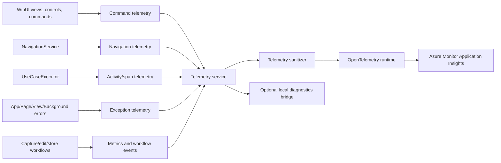

# PRD: OpenTelemetry and Azure Monitor Application Insights Telemetry

## Summary

Implementation status: draft PRD. No telemetry implementation is in place yet.

CaptureTool should add structured, privacy-conscious product and diagnostic telemetry using OpenTelemetry and export it to Azure Monitor Application Insights. The goal is to answer questions such as:

- Which commands and buttons are users invoking?
- Which screens and flows do users navigate through?
- Where do users abandon capture, edit, save, share, and purchase flows?
- Which errors and exceptions are happening in the wild?
- How long do critical workflows take?

Blunt assessment: the current telemetry architecture is not telemetry in any useful product sense. `ITelemetryService` formats strings and forwards them to `ILogService`. In production, `ILogService` is a short-term in-memory diagnostic log that is disabled by default, keeps only five minutes or 1,000 entries, and never leaves the device. It is useful as a local support/debug panel. It is not useful for product analytics, operational monitoring, crash triage, release quality, or feature adoption.

Recommendation: keep the local diagnostics feature, but build a separate OpenTelemetry-backed telemetry pipeline with typed event names, structured attributes, sanitization, sampling, user consent, and an Azure Monitor exporter. Do not simply forward the existing local log strings to Application Insights.

## Source Notes

- Azure Monitor OpenTelemetry exporter for .NET: https://learn.microsoft.com/en-us/dotnet/api/overview/azure/monitor.opentelemetry.exporter-readme
- Azure Monitor OpenTelemetry configuration, connection strings, cloud role/resource attributes, sampling, offline storage: https://learn.microsoft.com/en-us/azure/azure-monitor/app/opentelemetry-configuration
- Azure Monitor OpenTelemetry enablement overview: https://learn.microsoft.com/en-us/azure/azure-monitor/app/opentelemetry-enable
- Application Insights usage analysis with custom events, Users/Sessions/Events, Funnels, User Flows, Cohorts, and HEART workbooks: https://learn.microsoft.com/en-us/azure/azure-monitor/app/usage
- .NET observability with OpenTelemetry: https://learn.microsoft.com/en-us/dotnet/core/diagnostics/observability-with-otel
- OpenTelemetry .NET manual instrumentation: https://opentelemetry.io/docs/languages/dotnet/instrumentation/
- Application Insights FAQ on best-effort delivery and unencrypted offline storage: https://learn.microsoft.com/en-us/azure/azure-monitor/app/application-insights-faq

Important implementation constraints from the docs:

- For plain .NET applications, the Azure Monitor package is `Azure.Monitor.OpenTelemetry.Exporter`; the ASP.NET Core distro package is not the right default mental model for this WinUI desktop app.
- The exporter supports traces, metrics, and logs, and the provider instances must stay alive for the process lifetime and be disposed on shutdown so pending telemetry can flush.
- Azure Monitor custom events in .NET are emitted through the OpenTelemetry log signal by using `ILogger` and the `microsoft.custom_event.name` attribute.
- .NET OpenTelemetry instrumentation uses platform APIs: `ILogger` for logs, `System.Diagnostics.Metrics.Meter` for metrics, and `System.Diagnostics.ActivitySource`/`Activity` for traces.
- The Azure Monitor exporter currently documents AOT support, but reflection-based automatic configuration binding is not supported in AOT scenarios. CaptureTool publishes with Native AOT, so telemetry configuration should be programmatic and/or environment-variable based.
- Offline storage can exist, delivery is best effort, and local offline telemetry storage is not encrypted by Application Insights. The app must choose the storage directory intentionally or disable offline storage.

## Problem

CaptureTool has no remote observability. When a user presses a command, navigates to a page, hits a capture failure, loses an auto-save, cannot purchase an add-on, crashes during page load, or abandons a workflow, the project currently has no reliable way to know.

The current architecture creates the illusion that telemetry exists because the codebase has `ITelemetryService`, `ActivityInitiated`, `ActivityCompleted`, `ActivityError`, and `ButtonInvoked`. In practice:

- `ButtonInvoked` is effectively unused.
- Many commands bypass `UseCaseCommandExtensions` and therefore bypass the optional command telemetry path.
- Most view models do not pass `ITelemetryService` into command helpers.
- The use-case executor records only string lifecycle messages and no structured dimensions.
- Local logs are disabled by default unless verbose logging is enabled in settings.
- Local logs are intentionally short-lived and local-only.
- Existing exception logging can include sensitive local data such as file paths, so it is unsafe to bulk-upload as-is.
- Several UI and windowing catches swallow exceptions or log only locally.

This means the app cannot measure feature adoption, diagnose production failures at scale, quantify regressions, or validate whether recent work improved user outcomes.

## Goals

- Add remote telemetry export to Azure Monitor Application Insights through OpenTelemetry.
- Track button/command invocation with stable event names and structured dimensions.
- Track route navigation and screen-flow behavior.
- Track use-case spans with duration, outcome, cancellation, and exception status.
- Track critical product workflows: image capture, video capture, audio capture, file open, edit, save, copy, share, print, auto-save, auto-copy, store purchase, settings changes, diagnostics actions, and app activation.
- Track handled and unhandled exceptions with privacy-safe structured details.
- Add metrics for workflow duration, error counts, and critical success/failure rates.
- Add a telemetry taxonomy that prevents one-off event-name drift.
- Add user/session correlation that is anonymous, resettable, and not tied to personal identity.
- Add consent, privacy, and data-minimization controls before shipping remote product telemetry.
- Keep local diagnostics usable, but separate it from product telemetry.

## Non-Goals

- Capturing screenshots, audio, video, image contents, text annotations, OCR text, clipboard contents, file names, file paths, URLs, window titles, or audio input device names.
- Replacing Application Insights with a full data warehouse or experimentation platform.
- Building a telemetry proxy in the MVP unless direct ingestion risk is judged unacceptable.
- Guaranteeing delivery of every event. OpenTelemetry/Application Insights delivery is best effort.
- Treating telemetry as a crash dump collection system.
- Sending verbose local logs to Azure by default.
- Adding user account identity or cross-device identity.

## Current Architecture

### Local Logging

- `ILogService` exposes `LogInformation`, `LogWarning`, `LogException`, `GetLogs`, `ClearLogs`, `Enable`, and `Disable`.
- `LogServiceBase` stores `LogEntry` objects in memory only when enabled.
- `ShortTermMemoryLogService` keeps entries for five minutes and caps storage at 1,000 entries.
- `DebugLogService` is registered in debug builds; `ShortTermMemoryLogService` is registered in release builds.
- Diagnostics UI and export-log features use this local log service.

Assessment: this is a local diagnostics buffer. It should not be deleted, but it should not be confused with telemetry.

### Existing Telemetry Service

- `ITelemetryService` has `ActivityInitiated`, `ActivityCompleted`, `ActivityCanceled`, `ActivityError`, and `ButtonInvoked`.
- `TelemetryService` formats timestamped strings and writes them to `ILogService`.
- `ActivityError` captures caller/member/file/line context, then writes through `ILogService.LogException`.
- It has no remote exporter, no structured attributes, no event schema, no duration measurement, no metrics, no user/session context, no sampling, and no privacy sanitizer.

Assessment: this abstraction should either be replaced or substantially reshaped. Keeping the name is fine, but keeping the current shape is not.

### Command and Use-Case Flow

- `UseCaseExecutor` is a good instrumentation point because most application use cases run through it.
- `UseCaseCommandExtensions` can record telemetry, but telemetry is optional and most constructors do not pass it.
- Several important commands are manually created with `RelayCommand`/`AsyncRelayCommand`, especially in view models with custom guard logic.
- UI events in code-behind and custom controls are not covered by the use-case pipeline.

Assessment: central use-case telemetry will cover workflow outcomes, but it will not fully answer "which button did the user press" without a command-level instrumentation plan.

### Navigation Flow

- `NavigationService.Navigate`, `TryGoBack`, and `TryGoBackTo` are strong instrumentation points.
- `NavigationService.Navigated` fires after `INavigationHandler.HandleNavigationRequest`.
- `NavigationRequest` includes route, parameter, back-navigation state, and clear-history state.

Assessment: navigation telemetry can be centralized with minimal code churn.

### App Lifetime and Error Flow

- `App.xaml.cs` handles `UnhandledException` but logs locally only.
- Activation failures and unexpected activation kinds are logged locally only.
- `PageBase` and `ViewBase` log page/view load failures locally only.
- Background task failures, settings failures, capture post-processing failures, and store failures have partial local logging or local telemetry.
- Some windowing cleanup code catches and swallows exceptions.

Assessment: critical failures are currently invisible unless the user exports logs. Remote exception tracking needs a deliberate, sanitized path.

## Architecture Decision

Yes, the existing telemetry architecture needs improvement. More directly: it needs replacement for product telemetry.

The right split is:

- Local diagnostics: continue using `ILogService` for user-visible diagnostics and support export.
- Product telemetry: add an OpenTelemetry-backed pipeline with structured events, traces, metrics, and exceptions.
- Bridge only selected sanitized warnings/errors from diagnostics into product telemetry. Do not bulk-forward local log strings.

Product decisions for the MVP:

- Telemetry is opt-in and disabled by default through `CaptureToolSettings.Settings_Telemetry_IsEnabled`.
- Direct client-to-Azure Monitor Application Insights ingestion is acceptable for the MVP, with Azure ingestion caps, cost alerts, and sampling required before production enablement.
- A telemetry proxy/collector remains a follow-up option if direct ingestion proves too risky or too noisy.
- Crash/error telemetry follows the same opt-in setting as usage telemetry until a separate privacy decision is documented.

Recommended architecture:



## Telemetry Signals

### Events

Use events for discrete user/product facts:

- `ui.command.invoked`
- `navigation.completed`
- `capture.started`
- `capture.completed`
- `capture.cancelled`
- `capture.failed`
- `edit.command.invoked`
- `file.opened`
- `file.saved`
- `share.invoked`
- `settings.changed`
- `store.purchase.started`
- `store.purchase.completed`
- `diagnostics.action.invoked`
- `app.activated`
- `app.exited`

Implementation: emit Azure Monitor custom events through `ILogger` with the `microsoft.custom_event.name` structured attribute. Keep event names stable and define them as constants.

### Traces

Use traces/spans for operations with duration and nested work:

- Use case execution.
- Page/view load.
- Capture start/stop/finalize.
- Save/copy/share/print/export.
- Super resolution generation.
- Store calls.
- File picker calls where duration/outcome matters.
- External editor launch.

Implementation: use `ActivitySource`. Add `.AddSource("CaptureTool")` to the tracer provider. Set span status on exception/cancellation. Add sanitized tags.

### Metrics

Use metrics for aggregations that should survive trace sampling:

- Use-case duration histogram.
- Page load duration histogram.
- Capture duration histogram.
- Export/save/share duration histogram.
- Error counters by component and error category.
- Capture counts by capture type and outcome.
- Navigation counts by route.
- Auto-save/auto-copy success/failure counters.

Implementation: use `Meter`, `Counter<T>`, and `Histogram<T>`. Keep metric dimensions low-cardinality.

### Logs

Use logs for diagnostic messages, warnings, and exception context:

- Unhandled exception.
- Handled exception at meaningful boundaries.
- Platform capability unavailable.
- Store API failure.
- Capture device unavailable.
- File operation failure after sanitization.

Implementation: introduce `ILogger<T>` gradually. Keep `ILogService` for the diagnostics view, either as a local sink or a bridge from selected `ILogger` messages.

## Areas to Log

The table below uses "log" in the product sense: emit a structured OpenTelemetry signal, not a raw text log line.

| Area | What to record | Signal | Required attributes | Do not record |
| --- | --- | --- | --- | --- |
| App startup | app created, app initialized, startup completed/failed | span + event | app.version, build.channel, os.version.bucket, architecture, package.type | machine name, user name |
| Activation | launch/protocol activation source and result | event + span | activation.kind, activation.source_category, outcome | raw protocol URI/query |
| Navigation | route transitions | event + metric | from_route, to_route, is_back, clear_history, parameter_type, active_host | serialized parameter, file path |
| Home buttons | new image/video/audio capture | event | command, surface=home, target_capture_type | none |
| App menu | new capture, open file, recent capture, settings, add-ons, about, exit | event + span where use case runs | command, surface=app_menu, file_type for recent/opened | recent file path/name |
| Selection overlay | capture mode/type changes, close, selection accepted/cancelled | event | capture_type, capture_mode, selection_kind, outcome | selected screen content, window title |
| Image capture | capture requested/completed/failed | span + event + metric | capture_type=image, capture_mode, monitor_count_bucket, image_width_bucket, image_height_bucket, outcome | image pixels, file path |
| Video capture | prepare/start/pause/resume/stop/cancel/finalize | spans + events + metrics | capture_type=video, duration_bucket, has_desktop_audio, has_mic_audio, area_bucket, outcome | screen contents, file path |
| Audio capture | start/pause/resume/stop/cancel/mute/input selection/local audio toggle | events + spans + metrics | capture_type=audio, duration_bucket, has_local_audio, has_input_audio, muted, outcome | device name, audio samples |
| Edit page load | image/video/audio edit page loaded | span + metric | media_type, source=recent/open/capture, load_duration_ms, outcome | file path/name |
| Image edit tools | crop, shapes, text, color picker, chroma key, super resolution, rotate, flip, undo, redo, delete shape | events + selected spans | command, edit_mode, media_type=image, outcome | annotation text, picked text/content |
| Video edit tools | trim mode, preview, save, copy, folder, external editor | events + spans | command, media_type=video, trim_active, outcome | file path/name |
| Audio edit tools | playback-related failures, save, copy, folder, external editor | events + spans | command, media_type=audio, outcome | file path/name, waveform data |
| Export/save/copy/share/print | user intent and result | spans + events + metrics | command, media_type, output_type, cancelled, outcome, duration_ms | destination path/name, shared content |
| Settings | setting changed | event | setting_key, old_value_bucket, new_value_bucket, source=settings | folder path, language if considered sensitive beyond locale code |
| Folder changes | folder picker started/completed/cancelled | event | setting_key, outcome | selected folder path |
| Store/add-ons | add-on viewed, license checked, purchase requested/completed | spans + events | add_on_id, store_status, outcome | user/store account data |
| Diagnostics | enable/disable verbose logging, clear logs, export logs | event | action, outcome | exported log contents |
| Notifications | error/warning notification shown | event only for important user-facing failures | notification_kind, reason_code, route | full message if it contains dynamic data |
| Exceptions | unhandled and meaningful handled exceptions | exception telemetry + span status | exception.type, component, use_case, route, fatal, sanitized_message_code | raw message when it may include paths/content |
| Background work | task failure/success for important tasks | span + exception | task_name, outcome, duration_ms | task payload content |

## Event Naming

Use dotted, lowercase event names:

- `app.started`
- `app.activated`
- `app.shutdown_requested`
- `navigation.completed`
- `ui.command.invoked`
- `workflow.started`
- `workflow.completed`
- `workflow.cancelled`
- `workflow.failed`
- `capture.started`
- `capture.completed`
- `capture.cancelled`
- `capture.failed`
- `edit.command.invoked`
- `settings.changed`
- `store.purchase.started`
- `store.purchase.completed`
- `exception.captured`

Command IDs should remain PascalCase to match existing use-case IDs where useful:

- `OpenSelectionOverlay`
- `StartVideoCapture`
- `StopVideoCapture`
- `CaptureImage`
- `SaveImageFile`
- `ToggleSuperResolution`
- `OpenRecentCapture`

This gives Application Insights readable events while preserving the existing application vocabulary.

## Attribute Rules

Required on every signal:

- `app.name=CaptureTool`
- `app.version`
- `app.build_channel`
- `session.id`
- `install.id_hash`
- `route.current` when known
- `telemetry.schema_version`

Recommended:

- `feature.flags` only as specific boolean attributes for relevant features, not a giant serialized blob.
- `os.version.bucket`, for example `win10`, `win11_24h2`, `win11_25h2_or_newer`.
- `process.architecture`, for example `x64` or `arm64`.
- `package.identity_present`.

Strictly forbidden by default:

- File paths, file names, folder paths.
- Screenshot/image/audio/video content or content hashes.
- Clipboard contents.
- Raw exception messages that can include paths or user data.
- Window titles, process names of captured windows, or monitor names.
- Audio input device display names.
- User-entered annotation text.
- Raw protocol activation URI.

Allowed with care:

- File type/extension category: `png`, `jpg`, `mp4`, `wav`, `unknown`.
- Media dimensions as numeric measurements or buckets.
- Capture duration and export duration.
- Result status enum.
- Store product/add-on ID if it is not user-specific.

## Privacy and Consent Requirements

1. Add a distinct telemetry setting. Do not reuse `VerboseLogging`.
2. Decide before implementation whether telemetry is opt-in, opt-out with disclosure, or disabled in non-preview builds until the privacy policy is updated.
3. Add an in-app setting: "Send optional diagnostic and usage data".
4. Add a one-click reset for the anonymous install identifier.
5. Update the in-app privacy policy before enabling remote telemetry in production.
6. Keep the Application Insights connection string out of source where practical, but assume any connection string shipped in a desktop app can be extracted.
7. Configure ingestion caps and alerts in Azure to limit cost or abuse.
8. Consider a telemetry proxy or collector before broad public release if abuse/cost control matters.
9. If offline storage is enabled, place it under app data, document retention, and treat it as unencrypted local telemetry.
10. Add automated tests proving prohibited attributes are dropped or redacted.

Critical point: a connection string is not a read secret, but for a public desktop app it is still abusable for ingestion pollution and cost. Direct client-to-Application-Insights ingestion is acceptable for an MVP only if ingestion caps, sampling, and privacy controls are in place.

## Technical Requirements

### Packages

Add package references centrally:

- `Azure.Monitor.OpenTelemetry.Exporter`
- `OpenTelemetry`
- `OpenTelemetry.Extensions.Hosting` only if the app adopts the service-collection integration intentionally
- `OpenTelemetry.Instrumentation.Http` only if outbound HTTP telemetry becomes useful
- `Microsoft.Extensions.Logging`
- `Microsoft.Extensions.Logging.Abstractions`

Because the app currently builds a raw `ServiceProvider` and not a generic host, validate whether `AddOpenTelemetry().UseAzureMonitorExporter(...)` starts providers correctly in this WinUI lifecycle. If not, create and own `TracerProvider`, `MeterProvider`, and `LoggerFactory` explicitly in a singleton telemetry runtime.

### Telemetry Runtime

Add a singleton `ITelemetryRuntime` or `TelemetryRuntime` that owns:

- `ActivitySource`
- `Meter`
- `LoggerFactory`
- `TracerProvider`
- `MeterProvider`
- OpenTelemetry logger provider
- Azure Monitor exporter options
- shutdown/flush/dispose behavior

It should be initialized after settings are available and disposed from `AppServiceProvider.Dispose`.

### Telemetry Service Contract

Replace or evolve `ITelemetryService` into structured methods:

```csharp
public interface ITelemetryService
{
    IDisposable? StartActivity(string name, IReadOnlyDictionary<string, object?>? attributes = null);
    void TrackEvent(string eventName, IReadOnlyDictionary<string, object?>? attributes = null);
    void TrackException(Exception exception, TelemetryExceptionContext context);
    void TrackMetric(string metricName, double value, IReadOnlyDictionary<string, object?>? attributes = null);
}
```

### Event Catalog

Add a `TelemetryEvents` and `TelemetryAttributes` constants catalog. The codebase should not have magic string event names scattered across view models.

### Sanitization

Add `ITelemetrySanitizer`:

- Drop prohibited attribute keys.
- Redact values that look like paths.
- Bucket high-cardinality numeric values when used as dimensions.
- Normalize enums and booleans.
- Enforce maximum string length.
- Refuse dynamic event names.

### Context

Add `ITelemetryContext`:

- Anonymous install ID hash.
- Session ID.
- Current route.
- App version.
- Build channel.
- Feature availability booleans.

The install ID should be generated locally, persisted in settings/app data, and resettable.

### Use-Case Instrumentation

Update `UseCaseExecutor` to:

- Start an `Activity` for each use case.
- Record duration.
- Set status to success, cancelled, or error.
- Attach `use_case.id`, `component`, and outcome attributes.
- Track a metric for duration and failures.
- Track exceptions through `ITelemetryService.TrackException`.

Avoid double-counting nested use cases where possible. If a use case calls another use case, nesting spans is acceptable; duplicating user-action events is not.

### Command Instrumentation

Add a central command instrumentation path:

- For use-case backed commands, emit `ui.command.invoked` from command helpers.
- For manual commands, use a small `TelemetryCommandFactory` or explicit `TrackEvent` calls in command handlers.
- Include `command.id`, `surface`, `route.current`, and optional `target`.
- Do not rely on `ButtonInvoked`; replace it or make it a structured wrapper.

Important uncovered manual commands today include image edit tool commands, capture overlay custom commands, app menu guarded commands, and generated `[RelayCommand]` handlers.

### Navigation Instrumentation

Add `NavigationTelemetryObserver` or instrument `NavigationService` directly:

- Emit `navigation.completed`.
- Track `from_route`, `to_route`, `is_back`, `clear_history`, and `parameter_type`.
- Track navigation count metric.
- Do not serialize route parameters.

If route transition duration matters, add a span around navigation handler work in `RequestNavigation`.

### Exception Instrumentation

Instrument:

- `App.UnhandledException`
- Activation failure path
- `PageBase` load failures
- `ViewBase` load failures
- Background task failures
- Capture workflow and post-processing failures
- File save/copy/share failures
- Store service failures
- Settings load/save failures
- Known code-behind preview/render failures

Also audit empty `catch { }` blocks. Some cleanup failures can remain intentionally ignored, but important failures should be logged with a low-cardinality reason code.

### Local Diagnostics Bridge

Do not delete the diagnostics page.

Recommended path:

- Keep `ILogService` as the local diagnostics sink.
- Add `ILogger<T>` for new code.
- Optionally bridge selected warning/error `ILogger` messages into `ILogService` so diagnostics UI continues to work.
- Do not bridge all `ILogService` entries into Azure Monitor.

## Proposed Implementation

### Phase 1: Architecture and Privacy Foundation

- Add telemetry settings and consent decision.
- Add anonymous install/session ID service.
- Add telemetry event/attribute catalog.
- Add sanitizer with tests.
- Add PR/privacy-policy release checklist.
- Decide direct Application Insights ingestion versus a telemetry proxy.

### Phase 2: OpenTelemetry Runtime

- Add OpenTelemetry and Azure Monitor exporter packages.
- Add `TelemetryRuntime` with programmatic AOT-safe configuration.
- Configure resource attributes:
  - `service.name=CaptureTool`
  - `service.namespace=CaptureTool.Desktop`
  - `service.version`
  - `service.instance.id` as the anonymous install hash or a separate non-PII instance ID
- Configure Azure Monitor connection string by environment variable for local/dev and build/release configuration for production.
- Configure sampling.
- Trace sampling is controlled by `CAPTURETOOL_TELEMETRY_TRACE_SAMPLING_RATIO`; it defaults to `1.0`. Custom events and metrics are not sampled by this runtime knob.
- Choose offline storage directory or disable offline storage.
- Ensure provider lifetime and flush on shutdown.

### Phase 3: Structured Telemetry Service

- Replace string-only `TelemetryService` with structured events/spans/metrics.
- Keep compatibility wrappers for current `ActivityInitiated`/`Completed`/`Canceled`/`Error` while migrating call sites.
- Remove or replace `ButtonInvoked`.
- Add unit tests for event names, required attributes, and sanitization.

### Phase 4: Central Instrumentation

- Update `UseCaseExecutor`.
- Add `NavigationTelemetryObserver`.
- Add command telemetry for `UseCaseCommandExtensions`.
- Add a manual command instrumentation helper for custom `RelayCommand`/`AsyncRelayCommand` paths.
- Instrument app startup and activation.

### Phase 5: Workflow Instrumentation

- Instrument capture workflows for image/video/audio.
- Instrument edit/export/share/print/copy/save flows.
- Instrument settings changes.
- Instrument store add-on flows.
- Instrument diagnostics actions.
- Instrument key page/view load errors and durations.

### Phase 6: Azure Validation

- Run the telemetry smoke emitter documented in `docs/telemetry-azure-validation.md`.
- Verify custom events appear in Application Insights custom events.
- Verify spans appear with correct operation names and nested use-case relationships.
- Verify exceptions appear with sanitized attributes.
- Verify metrics appear and are queryable.
- Build starter workbooks:
  - Daily active installs/sessions.
  - Command usage by surface.
  - Capture funnel by type.
  - Edit-to-export funnel.
  - Error rate by app version.
  - Top failing use cases.
  - Store purchase funnel.
- Add Kusto query examples to docs.

## Example Event Schema

### `ui.command.invoked`

| Attribute | Example |
| --- | --- |
| `command.id` | `StartVideoCapture` |
| `surface` | `capture_overlay` |
| `route.current` | `CaptureOverlay` |
| `media.type` | `video` |
| `telemetry.schema_version` | `1` |

### `navigation.completed`

| Attribute | Example |
| --- | --- |
| `from_route` | `Home` |
| `to_route` | `ImageEdit` |
| `is_back` | `false` |
| `clear_history` | `false` |
| `parameter_type` | `ImageFile` |

### Use-Case Activity

| Attribute | Example |
| --- | --- |
| `use_case.id` | `SaveVideoFile` |
| `outcome` | `success` |
| `duration_ms` | `842` |
| `route.current` | `VideoEdit` |
| `media.type` | `video` |

### `exception.captured`

| Attribute | Example |
| --- | --- |
| `exception.type` | `UnauthorizedAccessException` |
| `component` | `Settings` |
| `use_case.id` | `ChangeScreenshotsFolder` |
| `route.current` | `Settings` |
| `fatal` | `false` |
| `reason_code` | `folder_access_denied` |

## Acceptance Criteria

- Remote telemetry can be enabled in development using an Application Insights connection string.
- Telemetry remains disabled or consent-gated according to the product decision.
- `ui.command.invoked` events are emitted for the main command surfaces.
- `navigation.completed` events are emitted for every successful route transition.
- Use cases emit spans with duration and outcome.
- Unhandled exceptions are emitted to Azure Monitor when telemetry is enabled.
- Handled exceptions at important boundaries are emitted with sanitized attributes.
- No telemetry event contains file path, file name, folder path, screenshot/audio/video content, clipboard content, window title, or raw protocol URI.
- Local diagnostics still work.
- Native AOT publish still succeeds.
- Provider disposal flushes telemetry on app shutdown as much as the platform allows.
- Application Insights workbooks or Kusto queries can answer:
  - top commands by route/surface
  - navigation flow by route
  - capture success/failure by capture type
  - edit/export/share adoption
  - errors by app version and use case

## Remaining Product And Operations Decisions

- Update the Store privacy disclosures or linked privacy policy before enabling production telemetry. Draft copy is in `docs/telemetry-store-privacy-disclosure.md`.
- Validate a development build against Application Insights before enabling production telemetry.
- Create separate development, preview, and production Application Insights resources or connection strings.
- Set Azure retention, ingestion caps, sampling, and cost alerts before any public release.
- Decide whether preview/beta channels should receive telemetry before stable builds.
- Decide whether local diagnostic export should include the current telemetry session ID so a user can correlate a support report with server-side telemetry.
- Revisit a proxy/collector if direct client ingestion produces spam, cost, or abuse concerns.

## Risks

- Shipping a connection string in a desktop app invites ingestion spam unless Azure caps/alerts or a proxy are used.
- Uploading existing log strings would leak local paths and possibly user data.
- Sampling can hide rare UI events if custom events are treated like ordinary logs; validate Application Insights behavior before relying on funnels.
- Adding telemetry without a taxonomy will create a noisy dataset that is expensive and hard to query.
- Too much instrumentation in view models can create maintenance drag; central chokepoints should carry most of the load.
- Provider lifetime is easy to get wrong because the app does not currently use a generic host.
- Native AOT and trimming require programmatic configuration and publish validation.
- Telemetry can become performative if no one owns dashboards, alerts, and weekly review.

## Tracking Checklist

- [x] Decide telemetry consent/default policy.
- [x] Decide direct Application Insights ingestion versus proxy/collector.
- [x] Add telemetry release checklist.
- [x] Update in-app privacy policy text before production telemetry enablement.
- [x] Add telemetry package references.
- [x] Add `TelemetryRuntime`.
- [x] Add structured `ITelemetryService`.
- [x] Add event and attribute constants.
- [x] Add sanitizer and tests.
- [x] Add anonymous install/session context.
- [x] Instrument `UseCaseExecutor`.
- [x] Instrument `NavigationService`.
- [x] Instrument command helpers.
- [x] Instrument manual command paths.
- [x] Instrument app startup/activation/shutdown.
- [x] Instrument unhandled and handled exception boundaries.
- [x] Instrument capture workflows.
- [x] Instrument edit/export/share workflows.
- [x] Instrument settings/store/diagnostics workflows.
- [ ] Verify Application Insights events, traces, metrics, and exceptions.
- [x] Add starter Kusto queries/workbooks.
- [x] Validate Native AOT publish.

Manual command instrumentation intentionally excludes continuous/high-frequency controls such as crop rectangle updates, zoom slider updates, color hover previews, and style sliders. Those should be added later as sampled interaction metrics only if a concrete product question needs them.
