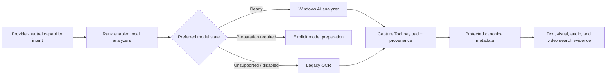

# PRD: Windows AI Capture Analysis Upgrade

- Status: Implemented behind Capture Analysis feature flags
- Date: 2026-08-12
- Parent architecture: [Capture Analysis Platform and Capture Memory](architecture-capture-analysis-platform.md)

## Outcome

Prefer stable on-device Windows AI models for OCR and selected video-frame description without making successful Capture Memory metadata collection depend on Copilot+ hardware. Use stable Microsoft Foundry Local for speech. Unsupported devices must continue producing useful metadata through existing local providers.

## Product requirements

1. Capture Analysis remains globally default-off and requires the existing explicit opt-in.
2. The Capture Memory purpose advances to version 3 because selected-frame visual descriptions broaden the disclosed derived metadata; earlier consent requires review.
3. Provider selection remains capability-based; recipes and search never name a Windows model.
4. Windows AI OCR is preferred for image OCR and video-frame OCR when ready.
5. Legacy `Windows.Media.Ocr` remains eligible when Windows AI OCR is unsupported or fails during an attempt.
6. Selected video frames receive Windows Image Description inference at a 15-second cadence with source-relative time ranges.
7. Video description is optional. An unsupported model must not prevent required video OCR or optional speech from completing.
8. Microsoft Foundry Local Whisper Tiny transcribes both captured audio and extracted video WAV audio.
9. Speech is divided into at most 15-second WAV windows so its normalized result retains useful search timecodes.
10. Prerelease Windows AI Speech Recognition is not compiled, referenced, registered, or packaged.
11. No provider fallback may cross from on-device to remote processing.
12. Model acquisition remains an explicit preparation action and never implicitly reads capture content.
13. Every canonical result records the actual provider/model/runtime/adapter revision that produced it.

## Provider policy

| Capability | Preferred provider | Fallback | Default flag |
|---|---|---|---|
| `ocr-document/v1` | Windows App SDK AI Text Recognizer | `Windows.Media.Ocr` | Preferred on |
| `video-ocr-track/v1` | Windows App SDK AI Text Recognizer over nominal frames | `Windows.Media.Ocr` over the same frame source | Preferred on |
| `video-description-track/v1` | Windows App SDK AI Image Description over selected frames | No substitute model; capability records unsupported | On, but optional |
| `speech-transcript/v1` | Stable Foundry Local Nemotron multilingual ASR | Microsoft Foundry Local Whisper Tiny | Both on; Nemotron has higher resolver tier |

The resolver evaluates enabled analyzers by explicit preference and quality. `NotSupported`, hardware incompatibility, missing OS capability, and a failed analyzer attempt permit the next eligible on-device analyzer. `PreparationRequired` pauses the preferred intent so the user can explicitly prepare that model; it does not silently select a lower-quality provider merely to avoid the preparation prompt.

## Pipeline design

Video analysis is three independent intents:

- nominal-frame OCR produces `video-ocr-track/v1`;
- 15-second selected-frame description produces `video-description-track/v1`;
- audio demultiplexing plus speech recognition produces `speech-transcript/v1`.

Each intent commits independently. A visual-description failure cannot discard OCR or transcript results.

## Compatibility and rollout

- Windows App SDK AI OCR and Image Description are capability-probed at runtime; the application retains its broader Windows minimum.
- All configurations use stable Windows App SDK and Windows App SDK AI packages. The former experimental speech provider project, build switch, package versions, feature flag, manifest, and tests have been removed from the repository.
- Advancing a model, adapter, configuration fingerprint, or resolution-policy revision makes only affected results stale.
- Removing an analyzer registration or disabling its flag leaves existing typed canonical results readable and searchable.

## Acceptance criteria

- A supported device resolves new Windows AI OCR ahead of legacy OCR.
- An unsupported device resolves legacy OCR without user-visible pipeline failure.
- Audio and video speech prefer stable Foundry Local Nemotron and fall back to Whisper when Nemotron is not ready, unsupported, fails, or returns no final speech.
- A model requiring preparation produces a preparation state and does not download until the user acts.
- Video visual matches include a source-relative timecode in Capture Memory.
- Audio/video transcript matches retain source-relative timecodes.
- Protected persistence round-trips the new video-description payload.
- x64 tests and builds pass, and x64/ARM64 publish validation remains AOT/trimming clean.
